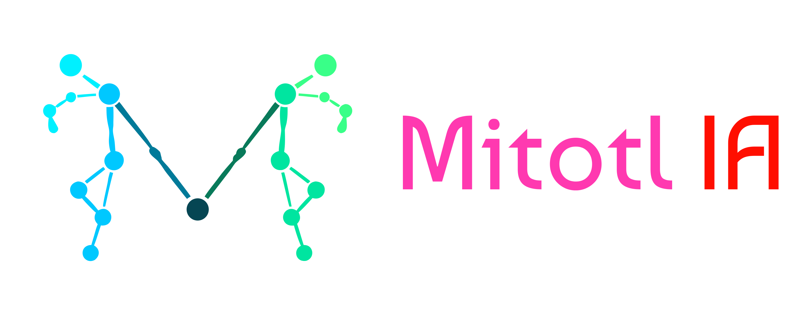

# Mitotl IA



[Abrir Mitotl IA en Streamlit](https://mitotl-ia.streamlit.app)

La [estrategia detallada y el diseño de solución](docs/00-estrategia.md) se encuentran en la carpeta `docs`. El desarrollo analítico está documentado en los [notebooks del proyecto](notebooks/), organizados por etapas del pipeline.

Plataforma experimental de inteligencia artificial para comparar un video de referencia con un video de ejecución de danza y generar retroalimentación educativa sobre el movimiento corporal.

Mitotl IA está pensada para apoyar la práctica autónoma: identifica diferencias de posición y sincronización, muestra los momentos de mayor desviación y sugiere qué partes del cuerpo conviene practicar. El resultado es una guía de similitud técnica; no es una calificación artística, médica ni profesional.

## Funcionalidades

- Carga de un video de referencia desde el catálogo AIST Dance Video Database o desde un archivo propio.
- Carga de un video de ejecución en formato `.mp4`, `.mov` o `.webm`.
- Validación básica de formato, duración, resolución y lectura del video.
- Extracción de landmarks corporales con MediaPipe Pose.
- Normalización de coordenadas usando el centro de las caderas como origen y la distancia entre hombros y caderas como escala.
- Cálculo de ángulos articulares, velocidades y variables corporales.
- Alineación temporal de los videos mediante Dynamic Time Warping (DTW).
- Score general y scores por grupo corporal: cabeza, torso, brazos y piernas.
- Recomendaciones basadas en reglas y hallazgos principales por momento y punto corporal.
- Video comparativo sincronizado y clips de momentos de alta severidad.
- Reporte descargable en PDF.
- Asistente conversacional opcional para explicar los resultados de una sesión.

## Flujo de análisis

```text
Videos de entrada
        ↓
Validación y preparación
        ↓
Extracción de pose con MediaPipe
        ↓
Normalización e ingeniería de variables
        ↓
Alineación temporal con DTW
        ↓
Comparación corporal y temporal
        ↓
Score + hallazgos + recomendaciones
        ↓
Visualizaciones, PDF y asistente
```

## Requisitos

- Python `>= 3.11, < 3.12`.
- Dependencias de sistema para OpenCV/MediaPipe. En despliegues Linux se incluyen en `packages.txt`:
  - `libgl1`
  - `libglib2.0-0t64`
- Para utilizar el asistente conversacional se necesita una clave de API de OpenAI.

Las dependencias de Python están declaradas en `pyproject.toml` y el archivo `uv.lock` permite reproducir el entorno con UV.

## Instalación

Desde la raíz del proyecto:

```bash
uv sync
```

Si no utilizas UV, puedes crear un entorno virtual e instalar el proyecto con las dependencias declaradas:

```bash
python3.11 -m venv .venv
source .venv/bin/activate       # Windows: .venv\Scripts\activate
python -m pip install --upgrade pip
python -m pip install -e .
```

## Ejecutar la aplicación

Inicia la interfaz con Streamlit:

```bash
uv run streamlit run app/streamlit_app.py
```

Con una instalación convencional también puedes ejecutar:

```bash
streamlit run app/streamlit_app.py
```

Después, abre la URL local mostrada por Streamlit y sigue este flujo:

1. Selecciona una referencia del catálogo AIST o carga un video propio.
2. Selecciona **Usar ejecución incluida** o carga tu propio video de ejecución.
3. Presiona **Analizar sesión**.
4. Consulta las pestañas **Resultados**, **Visualizaciones** y **Asistente**.
5. Descarga el reporte PDF o el video comparativo cuando estén disponibles.

### Recomendaciones para los videos

- Trabajar con una sola persona visible.
- Mantener el cuerpo completo dentro del encuadre.
- Usar una vista frontal o similar en ambos videos.
- Procurar buena iluminación y evitar oclusiones importantes.
- Comparar videos con movimientos equivalentes; una copia idéntica puede servir como prueba técnica, pero no valida la calidad de la retroalimentación.

## Configuración del asistente

El análisis principal funciona sin clave de API. La clave solo es necesaria para hacer preguntas en la pestaña **Asistente**.

Crea un archivo `.env` en la raíz del proyecto —no lo compartas ni lo subas al repositorio— con:

```dotenv
OPENAI_API_KEY=tu_clave_de_api
# Opcional; si se omite, la aplicación usa el modelo configurado por defecto en el código.
OPENAI_MODEL=tu_modelo
```

El asistente recibe un contexto resumido de la sesión: score, similitud por grupo corporal, similitud temporal, hallazgos y recomendaciones. No se envían todos los datos de landmarks ni los videos directamente al asistente.

## Uso como biblioteca

El pipeline también puede utilizarse desde Python. El resultado es un diccionario compatible con JSON:

```python
from mitotl.pipeline import analyze_session

resultado = analyze_session(
    "data/raw/reference/referencia.mp4",
    "data/raw/execution/ejecucion.mp4",
)

print(resultado["score"]["score_general"])
print(resultado["feedback"]["recommendations"])
```

Cuando el código se ejecuta fuera de la aplicación, asegúrate de que `src` esté disponible en el `PYTHONPATH` o instala el proyecto con `pip install -e .` / `uv sync`.

## Pruebas

Ejecuta la suite desde la raíz del proyecto:

```bash
uv run --with pytest pytest
```

Las pruebas cubren validación de videos, extracción y transformación de datos, comparación, reportes, visualizaciones y comportamiento del agente. Los archivos de `tests/` incluyen una sesión dorada para comprobar resultados esperados del pipeline.

## Notebooks

Los notebooks documentan el desarrollo analítico en orden:

1. `01_inventario_validacion_fuentes.ipynb`: inventario y validación de fuentes.
2. `02_extraccion_pose.ipynb`: extracción y revisión de landmarks.
3. `03_normalizacion_variables.ipynb`: normalización e ingeniería de variables.
4. `04_comparacion_poses_trayectorias.ipynb`: comparación de poses y trayectorias.
5. `05_sincronizacion_temporal_dtw.ipynb`: alineación temporal con DTW.
6. `06_score_reglas_retroalimentacion.ipynb`: score y recomendaciones basadas en reglas.
7. `07_agente_retroalimentacion.ipynb`: contexto y retroalimentación del asistente.

## Estructura del proyecto

```text
mitotl-ia/
├── app/                    # Interfaz Streamlit
├── src/mitotl/             # Pipeline y módulos de análisis
├── notebooks/              # Exploración y evidencia analítica
├── data/
│   ├── demo/               # Sesión y visualizaciones de demostración
│   ├── metadata/           # Inventario y reportes de calidad
│   ├── raw/                # Videos locales de entrada
│   └── derived/            # Pose, variables, alineación y scores
├── docs/                   # Documento académico, figuras y presentación
├── tests/                  # Pruebas automatizadas
├── assets/brand/           # Identidad visual
├── pyproject.toml          # Configuración y dependencias
├── uv.lock                # Versiones fijadas de dependencias
└── packages.txt           # Paquetes de sistema para despliegue Linux
```

Los videos y resultados derivados locales están excluidos del control de versiones mediante `.gitignore`. La aplicación incluye una ejecución de ejemplo para facilitar la demostración y puede descargar temporalmente una referencia del catálogo cuando el archivo no está disponible localmente.

## Datos y atribución

Las referencias del catálogo se obtienen mediante URLs de [AIST Dance Video Database](https://aistdancedb.ongaaccel.jp/). Su uso debe cumplir los [términos de uso de AIST Dance DB](https://aistdancedb.ongaaccel.jp/terms_of_use/), incluida la atribución correspondiente y la prohibición de redistribuir el contenido sin autorización.

El archivo `data/metadata/reference_video_inventory.csv` conserva el inventario y los metadatos de las referencias; no sustituye los permisos necesarios para utilizar o redistribuir los videos.

## Alcance y limitaciones actuales

- El MVP analiza videos previamente grabados; la captura directa desde cámara no está implementada.
- El flujo está diseñado para una sola persona.
- No se incluye análisis de grupos, oclusiones importantes ni personas parcialmente visibles.
- La comparación depende de que la cámara, el encuadre y la visibilidad corporal sean razonablemente comparables.
- La prueba con una copia idéntica del video de referencia es una prueba de humo del pipeline, no una evaluación de desempeño de danza.
- El score representa similitud de variables corporales y sincronización; no mide musicalidad, expresión, intención artística o calidad pedagógica.
- El asistente ofrece orientación educativa y no sustituye a una persona docente, evaluación profesional o valoración médica.

## Documentación adicional

- [Estrategia y diseño de solución](docs/00-estrategia.md)
- [Documento académico final](docs/documento_final.pdf)
- [Presentación final](docs/presentacion_final.pdf)
- [Documentación de la carpeta `docs`](docs/README.md)

## Licencia

Consulta [`LICENSE`](LICENSE) para conocer los términos de uso del código de este proyecto. Los videos de fuentes externas están sujetos a sus propias licencias y términos de uso.
