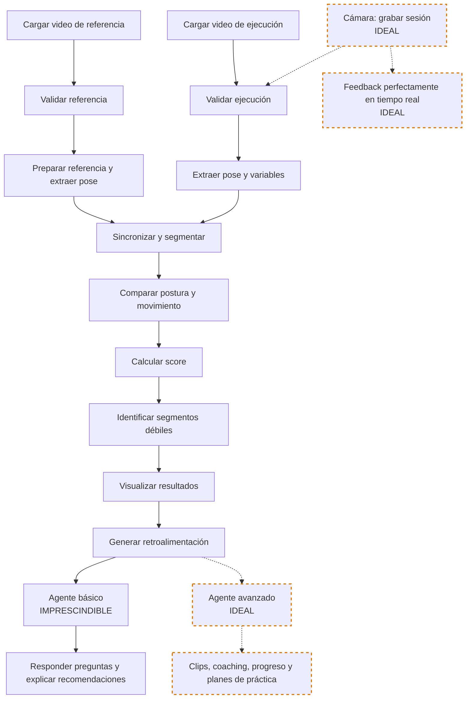

# Nomenclaturas

## Niveles de prioridad

- **IMPRESCINDIBLE:** Necesario para que el MVP cumpla su propósito.
- **IDEAL:** Aporta mucho valor, pero el MVP puede entregarse sin ello.
- **OPCIONAL:** Mejora la experiencia, pero no es prioritario.
- **OMITIBLE:** Puede descartarse sin afectar el objetivo principal.
- **FUTURAS_VERSIONES:** Funcionalidad posterior al MVP.

## Estados de avance

- **PENDIENTE:** No existe evidencia de implementación ni de avance técnico verificable en el repositorio.
- **DOCUMENTADO:** La decisión o definición está registrada, pero no existe validación de usuario o técnica. Se usa para distinguir alcance documentado de funcionalidad pendiente.
- **EN_DESARROLLO:** Existe código o trabajo parcial, pero aún no está completo.
- **IMPLEMENTADO:** La funcionalidad integrada existe en el proyecto.
- **VALIDADO:** Está implementada y cuenta con prueba, demo o artefacto verificable.

## Estados de implementación

- **⚪ No iniciado:** No existe implementación verificable en el repositorio.
- **📄 Documentado:** Existe una definición o decisión registrada, sin validación adicional.
- **🟡 En desarrollo:** Existe una implementación parcial o no integrada por completo.
- **🔵 Implementado:** La funcionalidad está integrada en el código del proyecto.
- **✅ Validado:** La funcionalidad está implementada y respaldada por pruebas, demos o artefactos verificables.

# Diseño de Solución

## Etapa 0 — Identidad del proyecto

### Nombre Compañía

**Etapa:** 0-Identidad del proyecto

**Rubro:** Nombre Compañía

**Subrubro:** —

**Descripción:** Mitotl IA

**Entregable / evidencia:** Nombre registrado en la estrategia del proyecto.

**Nivel de prioridad:** IMPRESCINDIBLE

**Estado de avance:** DOCUMENTADO

**Estado de implementación:** 📄 Documentado

### Logo Compañía

**Etapa:** 0-Identidad del proyecto

**Rubro:** Logo Compañía

**Subrubro:** —

**Descripción:** Mitotl IA

**Entregable / evidencia:** Logo integrado o referencia visual documentada.

**Nivel de prioridad:** IDEAL

**Estado de avance:** VALIDADO

**Estado de implementación:** ✅ Validado

## Etapa 1 — Planteamiento del Problema

### Nicho de Negocio

**Etapa:** 1-Planteamiento del Problema

**Rubro:** Nicho de Negocio

**Subrubro:** —

**Descripción:** Aprendizaje autónomo en clases de danza mediante videos de referencia, para identificar pasos o momentos específicos que pueden mejorar, sin evaluar si la persona baila bien o mal.

**Entregable / evidencia:** Descripción del nicho documentada.

**Nivel de prioridad:** IMPRESCINDIBLE

**Estado de avance:** DOCUMENTADO

**Estado de implementación:** 📄 Documentado

### Usuario Final

**Etapa:** 1-Planteamiento del Problema

**Rubro:** Usuario Final

**Subrubro:** —

**Descripción:** Personas que desean recibir retroalimentación sobre sus coreografías practicadas a solas, especialmente quienes hacen trends en TikTok o están aprendiendo con un video de referencia de un ejercicio o coreografía.

**Entregable / evidencia:** Perfil de usuario documentado.

**Nivel de prioridad:** IMPRESCINDIBLE

**Estado de avance:** DOCUMENTADO

**Estado de implementación:** 📄 Documentado

### Problema

**Etapa:** 1-Planteamiento del Problema

**Rubro:** Problema

**Subrubro:** —

**Descripción:** La persona puede tener dificultades para practicar si no cuenta con espejos, instalaciones adecuadas o videos de referencia. Incluso cuando ya conoce la coreografía, puede no identificar qué está fallando ni cómo mejorar.

**Entregable / evidencia:** Problema documentado y delimitado.

**Nivel de prioridad:** IMPRESCINDIBLE

**Estado de avance:** DOCUMENTADO

**Estado de implementación:** 📄 Documentado

### Necesidad

**Etapa:** 1-Planteamiento del Problema

**Rubro:** Necesidad

**Subrubro:** —

**Descripción:** La persona necesita identificar momentos específicos de dificultad, partes del cuerpo por corregir, explicaciones claras y una guía para practicar.

**Entregable / evidencia:** Necesidad documentada; confirmación con usuarios pendiente.

**Nivel de prioridad:** IMPRESCINDIBLE

**Estado de avance:** DOCUMENTADO

**Estado de implementación:** 📄 Documentado

### Propuesta de valor

**Etapa:** 1-Planteamiento del Problema

**Rubro:** Propuesta de valor

**Subrubro:** —

**Descripción:** Mitotl IA proporciona retroalimentación concreta sobre una coreografía y un agente conversacional básico que ayuda a interpretar el resultado y mejorar. El coaching personalizado, el seguimiento de progreso y los planes de práctica quedan para versiones avanzadas.

**Entregable / evidencia:** Propuesta de valor documentada y alcance básico/avanzado diferenciado.

**Nivel de prioridad:** IMPRESCINDIBLE

**Estado de avance:** DOCUMENTADO

**Estado de implementación:** 📄 Documentado

### Caso de uso principal

**Etapa:** 1-Planteamiento del Problema

**Rubro:** Caso de uso principal

**Subrubro:** —

**Descripción:** La persona sube un video de referencia y un video de ejecución, recibe un análisis comparativo con áreas de mejora y puede consultar al agente de IA sobre su desempeño o sobre una duda de danza. La captura mediante cámara queda como función ideal.

**Entregable / evidencia:** Flujo principal implementado y demostrado con videos cargados; flujo de cámara pendiente.

**Nivel de prioridad:** IMPRESCINDIBLE

**Estado de avance:** IMPLEMENTADO

**Estado de implementación:** 🔵 Implementado

## Etapa 2 — Fuente(s) de Datos

### Video de referencia

**Etapa:** 2-Fuente(s) de Datos

**Rubro:** Video de referencia

**Subrubro:** —

**Descripción:** Fuente académica seleccionada para obtener el video de referencia inicial del MVP. Se utilizará una secuencia de danza con una persona, cámara frontal y cuerpo completo visible. El video se empleará para probar la extracción de pose, la comparación corporal y el pipeline inicial. AIST Dance Database es la fuente principal de video del MVP y su uso está sujeto a sus condiciones académicas y términos de uso. El archivo local no debe redistribuirse. La copia idéntica como ejecución solamente sirve como prueba de humo y no representa una evaluación real de calidad de danza. Más adelante será necesario incorporar ejecuciones distintas realizadas por usuarios o videos con permisos compatibles. AIST no se utilizará como conjunto etiquetado para entrenar un modelo de calidad de danza, porque no contiene etiquetas de errores o desempeño correcto/incorrecto.

**Entregable / evidencia:** Enlace: https://aistdancedb.ongaaccel.jp/. Licencia o términos de uso, metadatos del video, archivo local ignorado por Git y registro en `data/metadata/reference_video_inventory.csv`.

**Nivel de prioridad:** IMPRESCINDIBLE

**Estado de avance:** VALIDADO

**Estado de implementación:** ✅ Validado

### Anotaciones y movimiento

**Etapa:** 2-Fuente(s) de Datos

**Rubro:** Anotaciones y movimiento

**Subrubro:** AIST++

**Descripción:** Fuente complementaria documentada para una posible validación técnica de anotaciones 2D, landmarks, confianza y cobertura corporal. No es la fuente principal de videos RGB ni forma parte del flujo mínimo del MVP; la descarga de sus anotaciones queda pendiente.

**Entregable / evidencia:** Información académica y decisión documentada en el notebook 01; las anotaciones no están descargadas ni integradas.

**Nivel de prioridad:** IDEAL

**Estado de avance:** DOCUMENTADO

**Estado de implementación:** 📄 Documentado

### Video de referencia

**Etapa:** 2-Fuente(s) de Datos

**Rubro:** Video de referencia

**Subrubro:** —

**Descripción:** Video de referencia alternativo cargado por la persona usuaria para aprender o imitar un movimiento. La aplicación permite cargarlo, pero no verifica automáticamente autorización, licencia o procedencia.

**Entregable / evidencia:** Componente de carga de referencia propia funcionando; registro de procedencia y permisos queda bajo responsabilidad de la persona usuaria.

**Nivel de prioridad:** IDEAL

**Estado de avance:** IMPLEMENTADO

**Estado de implementación:** 🔵 Implementado

### Video de ejecución

**Etapa:** 2-Fuente(s) de Datos

**Rubro:** Video de ejecución

**Subrubro:** —

**Descripción:** La carga del video de ejecución forma parte del MVP. La grabación mediante cámara y el análisis posterior se reservan como función ideal. La política de conservación o eliminación automática todavía está en discusión.

**Entregable / evidencia:** Video de ejecución cargado y analizado; flujo de cámara y política de conservación/eliminación pendientes.

**Nivel de prioridad:** IMPRESCINDIBLE

**Estado de avance:** IMPLEMENTADO

**Estado de implementación:** 🔵 Implementado

### Cámara

**Etapa:** 2-Fuente(s) de Datos

**Rubro:** Cámara

**Subrubro:** —

**Descripción:** La captura mediante cámara está definida como una función ideal del MVP para grabar una sesión de práctica y analizarla después. No necesita entregar feedback perfectamente en tiempo real; esa función queda como ideal. La política de conservación o eliminación automática todavía está en discusión.

**Entregable / evidencia:** No existe implementación de captura mediante cámara; la decisión de incluirla como función ideal está documentada y la política de conservación/eliminación queda pendiente.

**Nivel de prioridad:** IDEAL

**Estado de avance:** PENDIENTE

**Estado de implementación:** ⚪ No iniciado
### Fuente externa futura

**Etapa:** 2-Fuente(s) de Datos

**Rubro:** Fuente externa futura

**Subrubro:** —

**Descripción:** Posible fuente futura de videos de referencia. Su incorporación dependerá de permisos, licencia, disponibilidad técnica, restricciones de descarga y no redistribución del contenido. No forma parte de las fuentes confirmadas del MVP.

**Entregable / evidencia:** No existe una fuente adicional integrada ni una evaluación técnica concluida.

**Nivel de prioridad:** FUTURAS_VERSIONES

**Estado de avance:** PENDIENTE

**Estado de implementación:** ⚪ No iniciado

### Fuente externa futura

**Etapa:** 2-Fuente(s) de Datos

**Rubro:** Fuente externa futura

**Subrubro:** —

**Descripción:** Posible fuente futura de movimiento 3D y no fuente principal de video RGB. Su uso deberá definirse por separado de las fuentes de referencia visual del MVP.

**Entregable / evidencia:** No existe una fuente 3D integrada ni una evaluación técnica concluida.

**Nivel de prioridad:** FUTURAS_VERSIONES

**Estado de avance:** PENDIENTE

**Estado de implementación:** ⚪ No iniciado

### Datos derivados

**Etapa:** 2-Fuente(s) de Datos

**Rubro:** Datos derivados

**Subrubro:** —

**Descripción:** Resultados derivados del procesamiento de los videos: landmarks corporales, coordenadas normalizadas, ángulos articulares, trayectorias, marcas de tiempo, visibilidad, segmentos, diferencias y puntuaciones. No son fuentes externas; son resultados generados por Mitotl IA. La función inicial de Mitotl IA será una similitud basada en variables corporales, DTW y reglas ponderadas.

**Entregable / evidencia:** Esquema o tabla de datos derivados documentado.

**Nivel de prioridad:** IMPRESCINDIBLE

**Estado de avance:** VALIDADO

**Estado de implementación:** ✅ Validado

## Etapa 3 — EDA, Visualización

### Calidad del video

**Etapa:** 3-EDA, Visualización

**Rubro:** Calidad del video

**Subrubro:** —

**Descripción:** Revisión de la duración, cantidad de cuadros por segundo y resolución de los videos de referencia y ejecución para determinar si tienen condiciones adecuadas para el análisis.

**Entregable / evidencia:** Tabla de calidad de referencia, validación de entradas en el pipeline y artefactos locales de referencia y ejecución.

**Nivel de prioridad:** IMPRESCINDIBLE

**Estado de avance:** VALIDADO

**Estado de implementación:** ✅ Validado

### Detección corporal

**Etapa:** 3-EDA, Visualización

**Rubro:** Detección corporal

**Subrubro:** —

**Descripción:** El MVP se limita a una persona con el cuerpo completo visible. Se revisan los landmarks detectados y la visibilidad de cada punto corporal.

**Entregable / evidencia:** Tabla de calidad de landmarks de referencia y artefactos locales de pose para referencia y ejecución.

**Nivel de prioridad:** IMPRESCINDIBLE

**Estado de avance:** VALIDADO

**Estado de implementación:** ✅ Validado

### Detección corporal

**Etapa:** 3-EDA, Visualización

**Rubro:** Detección corporal

**Subrubro:** —

**Descripción:** Detección y manejo de más de una persona dentro del video. Esta capacidad queda reservada para una versión futura.

**Entregable / evidencia:** Prueba o diseño de detección de varias personas.

**Nivel de prioridad:** FUTURAS_VERSIONES

**Estado de avance:** PENDIENTE

**Estado de implementación:** ⚪ No iniciado

### Visualización de landmarks

**Etapa:** 3-EDA, Visualización

**Rubro:** Visualización de landmarks

**Subrubro:** —

**Descripción:** Representación de los landmarks corporales sobre el video o sobre imágenes de momentos seleccionados para inspeccionar la detección del movimiento.

**Entregable / evidencia:** Imagen o video con landmarks superpuestos y registro de la revisión.

**Nivel de prioridad:** IMPRESCINDIBLE

**Estado de avance:** VALIDADO

**Estado de implementación:** ✅ Validado

### Comparación de poses

**Etapa:** 3-EDA, Visualización

**Rubro:** Comparación de poses

**Subrubro:** —

**Descripción:** Contraste visual entre la pose del video de referencia y la pose del video de ejecución en momentos clave de la coreografía.

**Entregable / evidencia:** Gráfica o imagen comparativa de poses en momentos clave.

**Nivel de prioridad:** IMPRESCINDIBLE

**Estado de avance:** VALIDADO

**Estado de implementación:** ✅ Validado

### Trayectoria de articulaciones

**Etapa:** 3-EDA, Visualización

**Rubro:** Trayectoria de articulaciones

**Subrubro:** —

**Descripción:** Representación del recorrido de manos, brazos, piernas u otras articulaciones a lo largo de la ejecución y su comparación con la referencia.

**Entregable / evidencia:** Gráfica de trayectorias articulares por segmento o momento clave.

**Nivel de prioridad:** IDEAL

**Estado de avance:** VALIDADO

**Estado de implementación:** ✅ Validado

### Zonas de diferencia

**Etapa:** 3-EDA, Visualización

**Rubro:** Zonas de diferencia

**Subrubro:** —

**Descripción:** Señalamiento visual de las partes del cuerpo con mayor desviación respecto al video de referencia.

**Entregable / evidencia:** Imagen, video o mapa corporal con zonas de diferencia destacadas.

**Nivel de prioridad:** IMPRESCINDIBLE

**Estado de avance:** VALIDADO

**Estado de implementación:** ✅ Validado

### Tablas

**Etapa:** 3-EDA, Visualización

**Rubro:** Tablas

**Subrubro:** —

**Descripción:** Tabla de análisis por momento clave: tiempo, paso o movimiento esperado, parte del cuerpo involucrada, diferencia detectada y recomendación de mejora.

**Entregable / evidencia:** Tabla de hallazgos con momentos, movimientos esperados, partes del cuerpo, diferencias y recomendaciones.

**Nivel de prioridad:** IMPRESCINDIBLE

**Estado de avance:** VALIDADO

**Estado de implementación:** ✅ Validado

### Gráficas

**Etapa:** 3-EDA, Visualización

**Rubro:** Gráficas

**Subrubro:** —

**Descripción:** Comparación visual de poses entre el video de referencia y el de ejecución, trayectoria de articulaciones y zonas de diferencia en el cuerpo, enfocadas en momentos o segmentos clave de la coreografía.

**Entregable / evidencia:** Conjunto de gráficas ejecutadas para documentar el análisis.

**Nivel de prioridad:** IMPRESCINDIBLE

**Estado de avance:** VALIDADO

**Estado de implementación:** ✅ Validado

### KPIs

**Etapa:** 3-EDA, Visualización

**Rubro:** KPIs

**Subrubro:** —

**Descripción:** Porcentaje de coincidencia y similitud por parte del cuerpo de la sesión actual; la similitud temporal se muestra en la sección de sincronización y los hallazgos se presentan en una tabla separada. El avance entre sesiones queda como funcionalidad futura al requerir historial de prácticas.

**Entregable / evidencia:** Panel de score y similitudes corporales, tabla de sincronización temporal y tabla de hallazgos de la sesión analizada.

**Nivel de prioridad:** IMPRESCINDIBLE

**Estado de avance:** VALIDADO

**Estado de implementación:** ✅ Validado

## Etapa 4 — Ingeniería de variables

### Fase 1

**Etapa:** 4-Ingeniería de variables

**Rubro:** Fase 1

**Subrubro:** —

**Descripción:** Extracción de variables base de los videos cargados: puntos de articulación, coordenadas, ángulos, marcas de tiempo, velocidad de movimiento y normalización. La cámara en vivo queda como función ideal. Como posibles variables futuras: orientación general del cuerpo y nivel de confianza de la detección.

**Entregable / evidencia:** Conjunto de variables base documentado mediante sus subrubros y artefactos locales; captura en vivo no forma parte del flujo implementado.

**Nivel de prioridad:** IMPRESCINDIBLE

**Estado de avance:** VALIDADO

**Estado de implementación:** ✅ Validado

### Fase 1

**Etapa:** 4-Ingeniería de variables

**Rubro:** Fase 1

**Subrubro:** —

**Descripción:** Posición de cada landmark corporal a lo largo del video de referencia y del video de ejecución.

**Entregable / evidencia:** Tabla o archivo de coordenadas corporales extraídas.

**Nivel de prioridad:** IMPRESCINDIBLE

**Estado de avance:** VALIDADO

**Estado de implementación:** ✅ Validado

### Fase 1

**Etapa:** 4-Ingeniería de variables

**Rubro:** Fase 1

**Subrubro:** —

**Descripción:** Relaciones angulares entre articulaciones para describir la postura y el movimiento corporal.

**Entregable / evidencia:** Tabla o archivo de ángulos articulares calculados.

**Nivel de prioridad:** IMPRESCINDIBLE

**Estado de avance:** VALIDADO

**Estado de implementación:** ✅ Validado

### Fase 1

**Etapa:** 4-Ingeniería de variables

**Rubro:** Fase 1

**Subrubro:** —

**Descripción:** Nivel de visibilidad o confianza de cada landmark detectado para identificar puntos corporales poco confiables.

**Entregable / evidencia:** Tabla o archivo de visibilidad asociado a los landmarks.

**Nivel de prioridad:** IMPRESCINDIBLE

**Estado de avance:** VALIDADO

**Estado de implementación:** ✅ Validado

### Fase 1

**Etapa:** 4-Ingeniería de variables

**Rubro:** Fase 1

**Subrubro:** —

**Descripción:** Transformación de las coordenadas para hacer comparables los movimientos aunque cambie la distancia, escala o posición de la persona frente a la cámara.

**Entregable / evidencia:** Tabla o archivo de coordenadas normalizadas y criterio de transformación documentado.

**Nivel de prioridad:** IMPRESCINDIBLE

**Estado de avance:** VALIDADO

**Estado de implementación:** ✅ Validado

### Fase 1

**Etapa:** 4-Ingeniería de variables

**Rubro:** Fase 1

**Subrubro:** —

**Descripción:** Asociación de cada variable corporal con su instante correspondiente dentro del video.

**Entregable / evidencia:** Tabla o archivo de variables con marcas de tiempo.

**Nivel de prioridad:** IMPRESCINDIBLE

**Estado de avance:** VALIDADO

**Estado de implementación:** ✅ Validado

### Fase 1

**Etapa:** 4-Ingeniería de variables

**Rubro:** Fase 1

**Subrubro:** —

**Descripción:** Medición del cambio de posición de las articulaciones a lo largo del tiempo.

**Entregable / evidencia:** Tabla o archivo de velocidades articulares calculadas.

**Nivel de prioridad:** IMPRESCINDIBLE

**Estado de avance:** VALIDADO

**Estado de implementación:** ✅ Validado

### Fase 2

**Etapa:** 4-Ingeniería de variables

**Rubro:** Fase 2

**Subrubro:** —

**Descripción:** Cálculo de variables derivadas: similitud entre poses, diferencia de ángulos, desplazamiento de articulaciones, sincronización temporal y detección de momentos clave. Como posibles variables futuras: sincronización con el ritmo, suavidad del movimiento y consistencia entre repeticiones.

**Entregable / evidencia:** Conjunto de variables derivadas documentado mediante sus subrubros.

**Nivel de prioridad:** IMPRESCINDIBLE

**Estado de avance:** VALIDADO

**Estado de implementación:** ✅ Validado

### Fase 2

**Etapa:** 4-Ingeniería de variables

**Rubro:** Fase 2

**Subrubro:** —

**Descripción:** Diferencia de posición de las articulaciones entre momentos correspondientes de la referencia y la ejecución.

**Entregable / evidencia:** Tabla o archivo de desplazamientos articulares calculados.

**Nivel de prioridad:** IMPRESCINDIBLE

**Estado de avance:** VALIDADO

**Estado de implementación:** ✅ Validado

### Fase 2

**Etapa:** 4-Ingeniería de variables

**Rubro:** Fase 2

**Subrubro:** —

**Descripción:** Grado de coincidencia entre la pose del video de referencia y la pose del video de ejecución.

**Entregable / evidencia:** Tabla o archivo de valores de similitud por momento o segmento.

**Nivel de prioridad:** IMPRESCINDIBLE

**Estado de avance:** VALIDADO

**Estado de implementación:** ✅ Validado

### Fase 2

**Etapa:** 4-Ingeniería de variables

**Rubro:** Fase 2

**Subrubro:** —

**Descripción:** Desviación angular entre las articulaciones correspondientes de la referencia y la ejecución.

**Entregable / evidencia:** Tabla o archivo de diferencias angulares por articulación.

**Nivel de prioridad:** IMPRESCINDIBLE

**Estado de avance:** VALIDADO

**Estado de implementación:** ✅ Validado

### Fase 2

**Etapa:** 4-Ingeniería de variables

**Rubro:** Fase 2

**Subrubro:** —

**Descripción:** Alineación de momentos equivalentes entre el video de referencia y el video de ejecución para compararlos correctamente.

**Entregable / evidencia:** Archivo o tabla con la alineación temporal entre ambos videos.

**Nivel de prioridad:** IMPRESCINDIBLE

**Estado de avance:** VALIDADO

**Estado de implementación:** ✅ Validado

### Fase 2

**Etapa:** 4-Ingeniería de variables

**Rubro:** Fase 2

**Subrubro:** —

**Descripción:** División de la coreografía en partes o ventanas comparables para analizar movimientos específicos.

**Entregable / evidencia:** Segmentos identificados y registrados por rango de tiempo.

**Nivel de prioridad:** IMPRESCINDIBLE

**Estado de avance:** VALIDADO

**Estado de implementación:** ✅ Validado

### Fase 2

**Etapa:** 4-Ingeniería de variables

**Rubro:** Fase 2

**Subrubro:** —

**Descripción:** Identificación de instantes relevantes de la coreografía para generar hallazgos y retroalimentación.

**Entregable / evidencia:** Lista o tabla de momentos clave con sus marcas de tiempo.

**Nivel de prioridad:** IMPRESCINDIBLE

**Estado de avance:** VALIDADO

**Estado de implementación:** ✅ Validado

### Fase 2

**Etapa:** 4-Ingeniería de variables

**Rubro:** Fase 2

**Subrubro:** —

**Descripción:** Relación entre los movimientos corporales y el ritmo o la música de la coreografía.

**Entregable / evidencia:** Análisis documentado de sincronización entre movimiento y ritmo.

**Nivel de prioridad:** FUTURAS_VERSIONES

**Estado de avance:** PENDIENTE

**Estado de implementación:** ⚪ No iniciado

### Fase 2

**Etapa:** 4-Ingeniería de variables

**Rubro:** Fase 2

**Subrubro:** —

**Descripción:** Medición de la continuidad del movimiento y de la presencia de cambios bruscos durante la ejecución.

**Entregable / evidencia:** Métrica o visualización de suavidad del movimiento.

**Nivel de prioridad:** FUTURAS_VERSIONES

**Estado de avance:** PENDIENTE

**Estado de implementación:** ⚪ No iniciado

### Fase 2

**Etapa:** 4-Ingeniería de variables

**Rubro:** Fase 2

**Subrubro:** —

**Descripción:** Comparación de varias ejecuciones para medir la estabilidad del desempeño de la persona usuaria.

**Entregable / evidencia:** Comparación documentada entre repeticiones.

**Nivel de prioridad:** FUTURAS_VERSIONES

**Estado de avance:** PENDIENTE

**Estado de implementación:** ⚪ No iniciado

### Fase 3

**Etapa:** 4-Ingeniería de variables

**Rubro:** Fase 3

**Subrubro:** —

**Descripción:** Preparación de variables para el análisis principal: sincronización y segmentación de los videos, normalización de coordenadas, transformación de diferencias en indicadores comprensibles y validación de la calidad de captura. Estas variables pueden utilizarse para feedback visual en tiempo real, clasificado como ideal, y alimentarán al agente de IA.

**Entregable / evidencia:** Resultados preparados para visualización y agente mediante sus subrubros.

**Nivel de prioridad:** IMPRESCINDIBLE

**Estado de avance:** VALIDADO

**Estado de implementación:** ✅ Validado

### Fase 3

**Etapa:** 4-Ingeniería de variables

**Rubro:** Fase 3

**Subrubro:** —

**Descripción:** Transformación de las desviaciones corporales en valores comprensibles para interpretar el resultado del análisis.

**Entregable / evidencia:** Tabla o archivo de indicadores de diferencia por momento y parte del cuerpo.

**Nivel de prioridad:** IMPRESCINDIBLE

**Estado de avance:** VALIDADO

**Estado de implementación:** ✅ Validado

### Fase 3

**Etapa:** 4-Ingeniería de variables

**Rubro:** Fase 3

**Subrubro:** —

**Descripción:** Detección de videos incompletos, mala visibilidad o cantidad insuficiente de landmarks para producir un análisis confiable.

**Entregable / evidencia:** Reporte de validación con errores, advertencias y resultado de calidad.

**Nivel de prioridad:** IMPRESCINDIBLE

**Estado de avance:** VALIDADO

**Estado de implementación:** ✅ Validado

### Fase 3

**Etapa:** 4-Ingeniería de variables

**Rubro:** Fase 3

**Subrubro:** —

**Descripción:** Organización de los resultados para alimentar la visualización y el agente de IA.

**Entregable / evidencia:** Estructura de resultados lista para visualización y contexto del agente.

**Nivel de prioridad:** IMPRESCINDIBLE

**Estado de avance:** VALIDADO

**Estado de implementación:** ✅ Validado

## Etapa 5 — Modelación

### Elemento de la etapa

**Etapa:** 5-Modelación

**Rubro:** —

**Subrubro:** —

**Descripción:** En el MVP se utilizará un enfoque híbrido basado en un modelo preentrenado de estimación de pose, comparación geométrica de coordenadas y ángulos, alineación temporal mediante DTW y reglas con umbrales para generar alertas y recomendaciones. Para futuras versiones se consideran modelos temporales como LSTM, TCN o Transformers, modelos especializados en movimiento corporal y personalización por usuario.

**Entregable / evidencia:** Estrategia de modelación, resultados de evaluación y prueba de humo documentados mediante sus subrubros.

**Nivel de prioridad:** IMPRESCINDIBLE

**Estado de avance:** VALIDADO

**Estado de implementación:** ✅ Validado

### Extracción de pose

**Etapa:** 5-Modelación

**Rubro:** Extracción de pose

**Subrubro:** —

**Descripción:** Uso de un modelo preentrenado para obtener landmarks corporales a partir del video de referencia y del video de ejecución.

**Entregable / evidencia:** Resultado de extracción de pose sobre los videos de prueba.

**Nivel de prioridad:** IMPRESCINDIBLE

**Estado de avance:** VALIDADO

**Estado de implementación:** ✅ Validado

### Similitud corporal

**Etapa:** 5-Modelación

**Rubro:** Similitud corporal

**Subrubro:** —

**Descripción:** Comparación de poses, coordenadas, ángulos y desplazamientos para estimar el grado de coincidencia corporal.

**Entregable / evidencia:** Resultado de similitud por momento, segmento y parte del cuerpo.

**Nivel de prioridad:** IMPRESCINDIBLE

**Estado de avance:** VALIDADO

**Estado de implementación:** ✅ Validado

### Sincronización temporal / DTW

**Etapa:** 5-Modelación

**Rubro:** Sincronización temporal / DTW

**Subrubro:** —

**Descripción:** Alineación de las secuencias de referencia y ejecución mediante DTW para comparar movimientos realizados a diferentes velocidades.

**Entregable / evidencia:** Matriz o resultado de alineación temporal entre ambas secuencias.

**Nivel de prioridad:** IMPRESCINDIBLE

**Estado de avance:** VALIDADO

**Estado de implementación:** ✅ Validado

### Puntuación general

**Etapa:** 5-Modelación

**Rubro:** Puntuación general

**Subrubro:** —

**Descripción:** Score final = 80% similitud corporal + 20% similitud temporal. La escala será de 0 a 100 y representa una estimación orientativa para apoyar la práctica, no una evaluación profesional de calidad de danza.

**Entregable / evidencia:** Fórmula, escala y cálculo del score final documentados.

**Nivel de prioridad:** IMPRESCINDIBLE

**Estado de avance:** VALIDADO

**Estado de implementación:** ✅ Validado

### Puntuación por parte del cuerpo

**Etapa:** 5-Modelación

**Rubro:** Puntuación por parte del cuerpo

**Subrubro:** —

**Descripción:** Cálculo de resultados diferenciados para brazos, piernas, torso, cabeza u otras partes corporales.

**Entregable / evidencia:** Similitudes desglosadas por parte del cuerpo.

**Nivel de prioridad:** IMPRESCINDIBLE

**Estado de avance:** VALIDADO

**Estado de implementación:** ✅ Validado

### Puntuación temporal

**Etapa:** 5-Modelación

**Rubro:** Puntuación temporal

**Subrubro:** —

**Descripción:** Resultado de la alineación temporal y de la coincidencia del movimiento a lo largo de la secuencia.

**Entregable / evidencia:** Similitud temporal calculada y registrada.

**Nivel de prioridad:** IMPRESCINDIBLE

**Estado de avance:** VALIDADO

**Estado de implementación:** ✅ Validado

### Reglas de feedback

**Etapa:** 5-Modelación

**Rubro:** Reglas de feedback

**Subrubro:** —

**Descripción:** Conversión de las diferencias detectadas en recomendaciones concretas de mejora.

**Entregable / evidencia:** Catálogo de reglas y ejemplos de recomendaciones generadas.

**Nivel de prioridad:** IMPRESCINDIBLE

**Estado de avance:** VALIDADO

**Estado de implementación:** ✅ Validado

### Evaluación

**Etapa:** 5-Modelación

**Rubro:** Evaluación

**Subrubro:** —

**Descripción:** Verificación de que los landmarks corporales se detecten correctamente en los videos de prueba.

**Entregable / evidencia:** Reporte de revisión de landmarks detectados.

**Nivel de prioridad:** IMPRESCINDIBLE

**Estado de avance:** VALIDADO

**Estado de implementación:** ✅ Validado

### Evaluación

**Etapa:** 5-Modelación

**Rubro:** Evaluación

**Subrubro:** —

**Descripción:** Revisión técnica preliminar de que las puntuaciones reflejen las diferencias observables entre la referencia y la ejecución.

**Entregable / evidencia:** Comparación documentada entre resultados y diferencias observables; la evaluación de calidad de danza con usuarios queda pendiente.

**Nivel de prioridad:** IMPRESCINDIBLE

**Estado de avance:** VALIDADO

**Estado de implementación:** ✅ Validado

### Evaluación

**Etapa:** 5-Modelación

**Rubro:** Evaluación

**Subrubro:** —

**Descripción:** Comprobación del funcionamiento del pipeline completo utilizando AIST y una copia temporal de ejecución. Esta prueba técnica no representa una evaluación real de calidad de danza.

**Entregable / evidencia:** Resultado de prueba de humo documentado y aclaración de sus limitaciones.

**Nivel de prioridad:** IMPRESCINDIBLE

**Estado de avance:** VALIDADO

**Estado de implementación:** ✅ Validado

## Etapa 6 — Pipeline/Inferencia

### [Ir al Diagrama](#Diagrama-Pipeline)

**Etapa:** 6-Pipeline/Inferencia

**Rubro:** [Ir al Diagrama](#Diagrama-Pipeline)

**Subrubro:** —

**Descripción:**

**Entregable / evidencia:** Diagrama Mermaid actualizado y flujo documentado mediante sus subrubros.

**Nivel de prioridad:** IMPRESCINDIBLE

**Estado de avance:** VALIDADO

**Estado de implementación:** ✅ Validado

### Carga

**Etapa:** 6-Pipeline/Inferencia

**Rubro:** Carga

**Subrubro:** —

**Descripción:** Recepción del video de referencia y del video de ejecución cargado por la persona usuaria.

**Entregable / evidencia:** Prueba de carga de ambos videos y registro de entradas recibidas.

**Nivel de prioridad:** IMPRESCINDIBLE

**Estado de avance:** VALIDADO

**Estado de implementación:** ✅ Validado

### Validación

**Etapa:** 6-Pipeline/Inferencia

**Rubro:** Validación

**Subrubro:** —

**Descripción:** Revisión del formato, calidad, duración y condiciones mínimas de los videos antes de iniciar el análisis.

**Entregable / evidencia:** Reporte de validación de entradas con errores y advertencias.

**Nivel de prioridad:** IMPRESCINDIBLE

**Estado de avance:** VALIDADO

**Estado de implementación:** ✅ Validado

### Extracción

**Etapa:** 6-Pipeline/Inferencia

**Rubro:** Extracción

**Subrubro:** —

**Descripción:** Obtención de frames, landmarks y variables corporales a partir de los videos validados.

**Entregable / evidencia:** Resultado de extracción de frames, landmarks y variables.

**Nivel de prioridad:** IMPRESCINDIBLE

**Estado de avance:** VALIDADO

**Estado de implementación:** ✅ Validado

### Sincronización y segmentación

**Etapa:** 6-Pipeline/Inferencia

**Rubro:** Sincronización y segmentación

**Subrubro:** —

**Descripción:** Alineación temporal y división de los videos en momentos o ventanas comparables.

**Entregable / evidencia:** Segmentos alineados y registrados por rango de tiempo.

**Nivel de prioridad:** IMPRESCINDIBLE

**Estado de avance:** VALIDADO

**Estado de implementación:** ✅ Validado

### Comparación

**Etapa:** 6-Pipeline/Inferencia

**Rubro:** Comparación

**Subrubro:** —

**Descripción:** Comparación de la postura, los ángulos, las trayectorias y el movimiento entre la referencia y la ejecución.

**Entregable / evidencia:** Resultado comparativo por momento, segmento y parte del cuerpo.

**Nivel de prioridad:** IMPRESCINDIBLE

**Estado de avance:** VALIDADO

**Estado de implementación:** ✅ Validado

### Cálculo del score

**Etapa:** 6-Pipeline/Inferencia

**Rubro:** Cálculo del score

**Subrubro:** —

**Descripción:** Cálculo del score general y de resultados desglosados por momento, segmento y parte del cuerpo.

**Entregable / evidencia:** Score calculado y registrado para la sesión analizada.

**Nivel de prioridad:** IMPRESCINDIBLE

**Estado de avance:** VALIDADO

**Estado de implementación:** ✅ Validado

### Segmentos débiles

**Etapa:** 6-Pipeline/Inferencia

**Rubro:** Segmentos débiles

**Subrubro:** —

**Descripción:** Identificación de los momentos o segmentos en los que la ejecución presenta mayor diferencia respecto a la referencia.

**Entregable / evidencia:** Lista de segmentos débiles ordenados por nivel de desviación.

**Nivel de prioridad:** IMPRESCINDIBLE

**Estado de avance:** VALIDADO

**Estado de implementación:** ✅ Validado

### Visualización de resultados

**Etapa:** 6-Pipeline/Inferencia

**Rubro:** Visualización de resultados

**Subrubro:** —

**Descripción:** Presentación de scores, diferencias, poses comparadas y zonas del cuerpo que requieren atención.

**Entregable / evidencia:** Captura o demo de la visualización de resultados.

**Nivel de prioridad:** IMPRESCINDIBLE

**Estado de avance:** VALIDADO

**Estado de implementación:** ✅ Validado

### Retroalimentación

**Etapa:** 6-Pipeline/Inferencia

**Rubro:** Retroalimentación

**Subrubro:** —

**Descripción:** Transformación de los hallazgos del análisis en recomendaciones específicas para mejorar la ejecución.

**Entregable / evidencia:** Ejemplos de retroalimentación generada a partir de hallazgos.

**Nivel de prioridad:** IMPRESCINDIBLE

**Estado de avance:** VALIDADO

**Estado de implementación:** ✅ Validado

### Modo grabado

**Etapa:** 6-Pipeline/Inferencia

**Rubro:** Modo grabado

**Subrubro:** —

**Descripción:** Procesamiento de un video de referencia y un video de ejecución previamente cargados. Es el modo principal del MVP.

**Entregable / evidencia:** Demo funcional del análisis con videos cargados.

**Nivel de prioridad:** IMPRESCINDIBLE

**Estado de avance:** VALIDADO

**Estado de implementación:** ✅ Validado

### Modo cámara

**Etapa:** 6-Pipeline/Inferencia

**Rubro:** Modo cámara

**Subrubro:** —

**Descripción:** Grabación de una sesión de práctica mediante la cámara y análisis posterior del video. La cámara es una función ideal para el MVP y no requiere feedback perfectamente en tiempo real.

**Entregable / evidencia:** No existe implementación de captura mediante cámara ni demo de este flujo.

**Nivel de prioridad:** IDEAL

**Estado de avance:** PENDIENTE

**Estado de implementación:** ⚪ No iniciado

### Modo tiempo real

**Etapa:** 6-Pipeline/Inferencia

**Rubro:** Modo tiempo real

**Subrubro:** —

**Descripción:** Generación de retroalimentación mientras la persona realiza el movimiento frente a la cámara.

**Entregable / evidencia:** No existe implementación de captura ni retroalimentación durante la práctica.

**Nivel de prioridad:** IDEAL

**Estado de avance:** PENDIENTE

**Estado de implementación:** ⚪ No iniciado

### Agente básico

**Etapa:** 6-Pipeline/Inferencia

**Rubro:** Agente básico

**Subrubro:** —

**Descripción:** Uso del score, segmentos débiles y partes del cuerpo con mayor diferencia para responder preguntas y explicar recomendaciones básicas. Si no existe API key, el flujo de análisis y la alternativa no conversacional deben continuar disponibles.

**Entregable / evidencia:** Integración y demo del agente básico; la continuidad del análisis determinista sin API key está implementada, pero su prueba automatizada específica queda pendiente.

**Nivel de prioridad:** IMPRESCINDIBLE

**Estado de avance:** IMPLEMENTADO

**Estado de implementación:** 🔵 Implementado

## Etapa 7 — Consumo de modelos

### Elemento de la etapa

**Etapa:** 7-Consumo de modelos

**Rubro:** —

**Subrubro:** —

**Descripción:** MediaPipe será el modelo base del MVP para estimación de pose. Ultralytics queda reservado para futuras versiones. El agente conversacional básico será imprescindible, mientras que sus capacidades avanzadas se manejarán por separado como ideales o futuras.

**Entregable / evidencia:** Uso de modelos y alcance básico/avanzado del agente documentados mediante sus subrubros.

**Nivel de prioridad:** IMPRESCINDIBLE

**Estado de avance:** VALIDADO

**Estado de implementación:** ✅ Validado

### MediaPipe

**Etapa:** 7-Consumo de modelos

**Rubro:** MediaPipe

**Subrubro:** —

**Descripción:** Modelo seleccionado para extraer landmarks corporales del video de referencia AIST y del video de ejecución durante el MVP.

**Entregable / evidencia:** Resultado de extracción de pose con MediaPipe sobre videos de prueba.

**Nivel de prioridad:** IMPRESCINDIBLE

**Estado de avance:** VALIDADO

**Estado de implementación:** ✅ Validado

### Ultralytics

**Etapa:** 7-Consumo de modelos

**Rubro:** Ultralytics

**Subrubro:** —

**Descripción:** Modelo considerado para futuras versiones, como alternativa o ampliación de la estimación de pose del MVP.

**Entregable / evidencia:** Comparación documentada de resultados, compatibilidad y utilidad para una versión futura.

**Nivel de prioridad:** FUTURAS_VERSIONES

**Estado de avance:** PENDIENTE

**Estado de implementación:** ⚪ No iniciado

### Agente conversacional

**Etapa:** 7-Consumo de modelos

**Rubro:** Agente conversacional

**Subrubro:** —

**Descripción:** Agente básico en texto que recibe el score, los segmentos débiles y las partes del cuerpo con mayor diferencia; responde preguntas sobre el resultado y explica recomendaciones básicas. Puede funcionar con una API key configurada.

**Entregable / evidencia:** Demo del agente básico con contexto de una sesión analizada y prueba de contrato con cliente simulado.

**Nivel de prioridad:** IMPRESCINDIBLE

**Estado de avance:** VALIDADO

**Estado de implementación:** ✅ Validado

### Agente conversacional

**Etapa:** 7-Consumo de modelos

**Rubro:** Agente conversacional

**Subrubro:** —

**Descripción:** El agente recibirá resultados del análisis, scores, segmentos débiles, partes del cuerpo involucradas y recomendaciones para responder de forma contextual.

**Entregable / evidencia:** Ejemplo de contexto estructurado y respuestas del agente basadas en una sesión.

**Nivel de prioridad:** IMPRESCINDIBLE

**Estado de avance:** VALIDADO

**Estado de implementación:** ✅ Validado

### Agente conversacional

**Etapa:** 7-Consumo de modelos

**Rubro:** Agente conversacional

**Subrubro:** —

**Descripción:** Manejo controlado de la ausencia de API key mediante un mensaje claro; el análisis determinista y la consulta de resultados permanecen disponibles sin el agente.

**Entregable / evidencia:** Manejo implementado en la interfaz; prueba automatizada específica sin API key pendiente.

**Nivel de prioridad:** IMPRESCINDIBLE

**Estado de avance:** IMPLEMENTADO

**Estado de implementación:** 🔵 Implementado

### Agente conversacional

**Etapa:** 7-Consumo de modelos

**Rubro:** Agente conversacional

**Subrubro:** —

**Descripción:** Análisis multimodal de clips, coaching personalizado, seguimiento de progreso, explicación avanzada de conceptos y planes de práctica.

**Entregable / evidencia:** Diseño o prototipo de capacidades avanzadas.

**Nivel de prioridad:** IDEAL

**Estado de avance:** PENDIENTE

**Estado de implementación:** ⚪ No iniciado
## Etapa 8 — Elementos gráficos

### Elemento de la etapa

**Etapa:** 8-Elementos gráficos

**Rubro:** —

**Subrubro:** —

**Descripción:** Carga del video de referencia y del video de ejecución. Reproductor con comparación de poses y zonas de diferencia, tabla de hallazgos y recomendaciones, indicadores principales, campo de texto para conversar con el agente de IA y controles disponibles para iniciar y consultar el análisis. La cámara, pausa y repetición quedan fuera del flujo actual.

**Entregable / evidencia:** Prototipo funcional y evidencias locales de interfaz; cámara, pausa y repetición quedan fuera del flujo actual.

**Nivel de prioridad:** IMPRESCINDIBLE

**Estado de avance:** IMPLEMENTADO

**Estado de implementación:** 🔵 Implementado

### Identidad visual

**Etapa:** 8-Elementos gráficos

**Rubro:** Identidad visual

**Subrubro:** —

**Descripción:** Elemento visual para identificar Mitotl IA dentro de la aplicación.

**Entregable / evidencia:** Logo integrado en la interfaz.

**Nivel de prioridad:** IDEAL

**Estado de avance:** VALIDADO

**Estado de implementación:** ✅ Validado

### Entrada de referencia

**Etapa:** 8-Elementos gráficos

**Rubro:** Entrada de referencia

**Subrubro:** —

**Descripción:** Componente para cargar y visualizar el video de referencia seleccionado.

**Entregable / evidencia:** Captura o demo de la tarjeta de referencia funcionando.

**Nivel de prioridad:** IMPRESCINDIBLE

**Estado de avance:** VALIDADO

**Estado de implementación:** ✅ Validado

### Entrada de ejecución

**Etapa:** 8-Elementos gráficos

**Rubro:** Entrada de ejecución

**Subrubro:** —

**Descripción:** Componente para cargar el video de ejecución de la persona usuaria. El acceso a la cámara queda como función ideal.

**Entregable / evidencia:** Captura o demo de la tarjeta de ejecución cargando un archivo.

**Nivel de prioridad:** IMPRESCINDIBLE

**Estado de avance:** VALIDADO

**Estado de implementación:** ✅ Validado

### Cámara

**Etapa:** 8-Elementos gráficos

**Rubro:** Cámara

**Subrubro:** —

**Descripción:** Componente ideal para grabar una sesión de práctica y enviarla al análisis posterior. El feedback perfectamente en tiempo real queda como funcionalidad ideal.

**Entregable / evidencia:** No existe componente de cámara ni demo de captura con controles.

**Nivel de prioridad:** IDEAL

**Estado de avance:** PENDIENTE

**Estado de implementación:** ⚪ No iniciado

### Score

**Etapa:** 8-Elementos gráficos

**Rubro:** Score

**Subrubro:** —

**Descripción:** Visualización del resultado general y de los resultados desglosados por parte del cuerpo.

**Entregable / evidencia:** Captura o demo de scores generales y corporales.

**Nivel de prioridad:** IMPRESCINDIBLE

**Estado de avance:** VALIDADO

**Estado de implementación:** ✅ Validado

### Gráficas

**Etapa:** 8-Elementos gráficos

**Rubro:** Gráficas

**Subrubro:** —

**Descripción:** Visualización del video comparativo sincronizado, poses y landmarks superpuestos, zonas de diferencia y similitud temporal entre referencia y ejecución. Las trayectorias articulares se mantienen como evidencia exploratoria del EDA.

**Entregable / evidencia:** Capturas y demo de las visualizaciones de la aplicación; trayectorias documentadas en los notebooks exploratorios.

**Nivel de prioridad:** IMPRESCINDIBLE

**Estado de avance:** VALIDADO

**Estado de implementación:** ✅ Validado

### Tabla de hallazgos

**Etapa:** 8-Elementos gráficos

**Rubro:** Tabla de hallazgos

**Subrubro:** —

**Descripción:** Presentación tabular de los momentos analizados, las diferencias detectadas y las recomendaciones correspondientes.

**Entregable / evidencia:** Captura o demo de la tabla de hallazgos.

**Nivel de prioridad:** IMPRESCINDIBLE

**Estado de avance:** VALIDADO

**Estado de implementación:** ✅ Validado

### Clips comparativos

**Etapa:** 8-Elementos gráficos

**Rubro:** Clips comparativos

**Subrubro:** —

**Descripción:** Presentación de fragmentos de la referencia y la ejecución correspondientes a los segmentos con mayor diferencia.

**Entregable / evidencia:** Demo de clips comparativos de segmentos débiles.

**Nivel de prioridad:** IDEAL

**Estado de avance:** VALIDADO

**Estado de implementación:** ✅ Validado

### Asistente

**Etapa:** 8-Elementos gráficos

**Rubro:** Asistente

**Subrubro:** —

**Descripción:** Componente de interfaz para realizar preguntas al agente básico sobre el análisis o sobre dudas específicas de danza.

**Entregable / evidencia:** Captura o demo del asistente básico respondiendo en la interfaz.

**Nivel de prioridad:** IMPRESCINDIBLE

**Estado de avance:** VALIDADO

**Estado de implementación:** ✅ Validado

### Asistente avanzado

**Etapa:** 8-Elementos gráficos

**Rubro:** Asistente avanzado

**Subrubro:** —

**Descripción:** Interfaz futura para análisis multimodal, coaching personalizado, seguimiento de progreso, explicación avanzada y planes de práctica.

**Entregable / evidencia:** Prototipo o diseño de la interfaz avanzada.

**Nivel de prioridad:** IDEAL

**Estado de avance:** PENDIENTE

**Estado de implementación:** ⚪ No iniciado

### Controles

**Etapa:** 8-Elementos gráficos

**Rubro:** Controles

**Subrubro:** —

**Descripción:** Control para iniciar el análisis y consultar los resultados mediante las pestañas, visualizaciones y descargas disponibles. Pausa y repetición de la sesión quedan fuera del flujo actual.

**Entregable / evidencia:** Demo del botón de análisis, navegación de resultados y descargas; pausa y repetición pendientes.

**Nivel de prioridad:** IMPRESCINDIBLE

**Estado de avance:** IMPLEMENTADO

**Estado de implementación:** 🔵 Implementado

### Estados de proceso

**Etapa:** 8-Elementos gráficos

**Rubro:** Estados de proceso

**Subrubro:** —

**Descripción:** Indicadores visuales para mostrar la carga de archivos, el análisis en curso y la disponibilidad de resultados.

**Entregable / evidencia:** Capturas o demo de los estados del proceso.

**Nivel de prioridad:** IMPRESCINDIBLE

**Estado de avance:** VALIDADO

**Estado de implementación:** ✅ Validado

### Estados de error

**Etapa:** 8-Elementos gráficos

**Rubro:** Estados de error

**Subrubro:** —

**Descripción:** Manejo visual de video inválido, landmarks insuficientes o ausencia de API key. El estado de cámara no disponible queda reservado para la función ideal de cámara.

**Entregable / evidencia:** Capturas o pruebas de los estados de error implementados y sus mensajes; estado de cámara pendiente.

**Nivel de prioridad:** IMPRESCINDIBLE

**Estado de avance:** EN_DESARROLLO

**Estado de implementación:** 🟡 En desarrollo

## Diagrama Pipeline

# Stack Tecnológico

### Python

**Uso:** Lenguaje principal para el procesamiento de videos, extracción de variables, modelación y lógica de la aplicación.

**Nivel de prioridad:** IMPRESCINDIBLE

**Estado de avance:** VALIDADO

**Estado de implementación:** ✅ Validado

### UV

**Uso:** Gestión del entorno del proyecto y sus dependencias.

**Nivel de prioridad:** IMPRESCINDIBLE

**Estado de avance:** IMPLEMENTADO

**Estado de implementación:** 🔵 Implementado

### Streamlit

**Uso:** Interfaz inicial de carga, análisis y visualización.

**Nivel de prioridad:** IMPRESCINDIBLE

**Estado de avance:** VALIDADO

**Estado de implementación:** ✅ Validado

### OpenCV

**Uso:** Lectura, extracción de frames y procesamiento de video.

**Nivel de prioridad:** IMPRESCINDIBLE

**Estado de avance:** VALIDADO

**Estado de implementación:** ✅ Validado

### MediaPipe

**Uso:** Extracción de landmarks y estimación de pose para el MVP.

**Nivel de prioridad:** IMPRESCINDIBLE

**Estado de avance:** VALIDADO

**Estado de implementación:** ✅ Validado

### NumPy

**Uso:** Cálculo y transformación de variables numéricas y corporales.

**Nivel de prioridad:** IMPRESCINDIBLE

**Estado de avance:** VALIDADO

**Estado de implementación:** ✅ Validado

### Pandas

**Uso:** Organización, consulta y análisis tabular de variables y resultados.

**Nivel de prioridad:** IMPRESCINDIBLE

**Estado de avance:** VALIDADO

**Estado de implementación:** ✅ Validado

### DTW

**Uso:** Alineación temporal de las secuencias de referencia y ejecución.

**Nivel de prioridad:** IMPRESCINDIBLE

**Estado de avance:** VALIDADO

**Estado de implementación:** ✅ Validado

### Streamlit-WebRTC

**Uso:** Captura y procesamiento de video mediante cámara para grabar sesiones del MVP; el feedback perfectamente en tiempo real queda como función ideal.

**Nivel de prioridad:** IDEAL

**Estado de avance:** PENDIENTE

**Estado de implementación:** ⚪ No iniciado

### OpenAI API (Responses API)

**Uso:** Construcción del agente conversacional básico del MVP mediante el cliente oficial y Responses API; las capacidades avanzadas quedan como función ideal.

**Nivel de prioridad:** IMPRESCINDIBLE

**Estado de avance:** IMPLEMENTADO

**Estado de implementación:** 🔵 Implementado

### Angular

**Uso:** Posible evolución futura de la interfaz de la aplicación.

**Nivel de prioridad:** FUTURAS_VERSIONES

**Estado de avance:** PENDIENTE

**Estado de implementación:** ⚪ No iniciado
