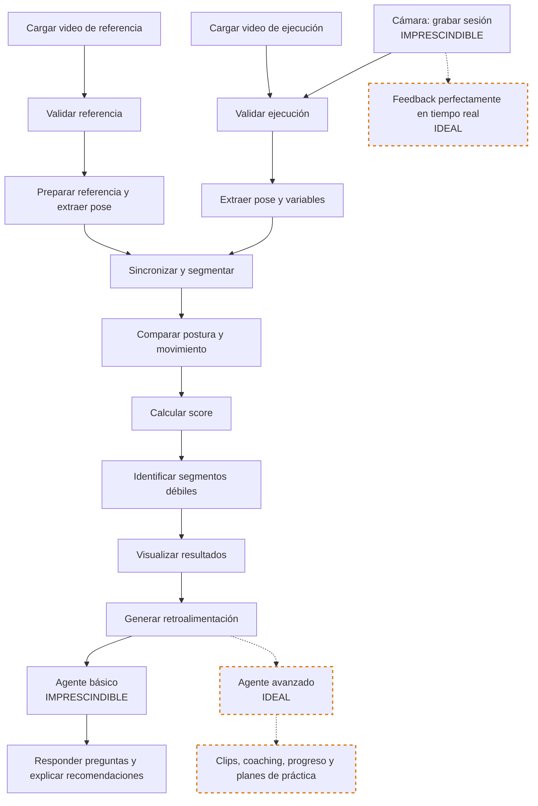

# Nomenclaturas

## Niveles de prioridad

| Nivel             | Significado                                                |
| ----------------- | ---------------------------------------------------------- |
| IMPRESCINDIBLE    | Necesario para que el MVP cumpla su propósito.             |
| IDEAL             | Aporta mucho valor, pero el MVP puede entregarse sin ello. |
| OPCIONAL          | Mejora la experiencia, pero no es prioritario.             |
| OMITIBLE          | Puede descartarse sin afectar el objetivo principal.       |
| FUTURAS_VERSIONES | Funcionalidad posterior al MVP.                            |

## Estados de avance

| Estado        | Significado                                      |
| ------------- | ------------------------------------------------ |
| PENDIENTE     | Todavía no se ha trabajado.                      |
| EN_DISCUSIÓN  | Aún se está definiendo.                          |
| DEFINIDO      | Ya existe una decisión tomada.                   |
| EN_DESARROLLO | Se está implementando.                           |
| IMPLEMENTADO  | Ya existe en el proyecto.                        |
| VALIDADO      | Fue probado y funciona según lo esperado.        |
| OBSOLETO      | Ya no aplica, pero se conserva como antecedente. |

# Diseño de Solución

## Etapa 0 — Identidad del proyecto

| Etapa | Rubro | Subrubro | Descripción | Entregable / evidencia | Nivel de Prioridad | Estado de avance | Estado de implementación |
| --- | --- | --- | --- | --- | --- | --- | --- |
| 0-Identidad del proyecto | Nombre Compañía |  | Mitotl IA | Nombre registrado en la estrategia del proyecto. | IMPRESCINDIBLE | DEFINIDO | ⚪ No iniciado |
| 0-Identidad del proyecto | Logo Compañía |  | Mitotl IA | Logo integrado o referencia visual documentada. | IMPRESCINDIBLE | DEFINIDO | ⚪ No iniciado |

## Etapa 1 — Planteamiento del Problema

| Etapa | Rubro | Subrubro | Descripción | Entregable / evidencia | Nivel de Prioridad | Estado de avance | Estado de implementación |
| --- | --- | --- | --- | --- | --- | --- | --- |
| 1-Planteamiento del Problema | Nicho de Negocio |  | Aprendizaje autónomo en clases de danza mediante videos de referencia, para identificar pasos o momentos específicos que pueden mejorar, sin evaluar si la persona baila bien o mal. | Descripción del nicho documentada. | IMPRESCINDIBLE | DEFINIDO | ⚪ No iniciado |
| 1-Planteamiento del Problema | Usuario Final |  | Personas que desean recibir retroalimentación sobre sus coreografías practicadas a solas, especialmente quienes hacen trends en TikTok o están aprendiendo con un video de referencia de un ejercicio o coreografía. | Perfil de usuario documentado. | IMPRESCINDIBLE | DEFINIDO | ⚪ No iniciado |
| 1-Planteamiento del Problema | Problema |  | La persona puede tener dificultades para practicar si no cuenta con espejos, instalaciones adecuadas o videos de referencia. Incluso cuando ya conoce la coreografía, puede no identificar qué está fallando ni cómo mejorar. | Problema documentado y delimitado. | IMPRESCINDIBLE | DEFINIDO | ⚪ No iniciado |
| 1-Planteamiento del Problema | Necesidad |  | La persona necesita identificar momentos específicos de dificultad, partes del cuerpo por corregir, explicaciones claras y una guía para practicar. | Lista de necesidades confirmadas del usuario. | IMPRESCINDIBLE | DEFINIDO | ⚪ No iniciado |
| 1-Planteamiento del Problema | Propuesta de valor |  | Mitotl IA proporciona retroalimentación concreta sobre una coreografía y un agente conversacional básico que ayuda a interpretar el resultado y mejorar. El coaching personalizado, el seguimiento de progreso y los planes de práctica quedan para versiones avanzadas. | Propuesta de valor documentada y alcance básico/avanzado diferenciado. | IMPRESCINDIBLE | DEFINIDO | ⚪ No iniciado |
| 1-Planteamiento del Problema | Caso de uso principal |  | La persona sube un video de referencia, sube su propio video o activa la cámara, recibe un análisis comparativo con áreas de mejora y puede consultar al agente de IA sobre su desempeño o sobre una duda de danza. | Flujo principal de uso documentado. | IMPRESCINDIBLE | DEFINIDO | ⚪ No iniciado |

## Etapa 2 — Fuente(s) de Datos

| Etapa | Rubro | Subrubro | Descripción | Entregable / evidencia | Nivel de Prioridad | Estado de avance | Estado de implementación |
| --- | --- | --- | --- | --- | --- | --- | --- |
| 2-Fuente(s) de Datos | Video de referencia |  | Fuente académica seleccionada para obtener el video de referencia inicial del MVP. Se utilizará una secuencia de danza con una persona, cámara frontal y cuerpo completo visible. El video se empleará para probar la extracción de pose, la comparación corporal y el pipeline inicial. AIST Dance Database es la fuente principal de video del MVP y su uso está sujeto a sus condiciones académicas y términos de uso. El archivo local no debe redistribuirse. La copia idéntica como ejecución solamente sirve como prueba de humo y no representa una evaluación real de calidad de danza. Más adelante será necesario incorporar ejecuciones distintas realizadas por usuarios o videos con permisos compatibles. AIST no se utilizará como conjunto etiquetado para entrenar un modelo de calidad de danza, porque no contiene etiquetas de errores o desempeño correcto/incorrecto. | Enlace: https://aistdancedb.ongaaccel.jp/. Licencia o términos de uso, metadatos del video, archivo local ignorado por Git y registro en `data/metadata/references.csv`. | IMPRESCINDIBLE | DEFINIDO | ⚪ No iniciado |
| 2-Fuente(s) de Datos | Anotaciones y movimiento | AIST++ | Fuente complementaria para explorar anotaciones 2D, revisar landmarks, confianza y cobertura corporal, identificar secuencias disponibles, excluir secuencias incluidas en `ignore_list.txt`, relacionar las anotaciones con videos RGB de AIST Dance Video Database, seleccionar candidatos de cámara frontal y validar técnicamente la extracción de pose con MediaPipe como apoyo al EDA del notebook 01. AIST++ no es la fuente principal de videos RGB: los videos RGB se obtienen de AIST Dance Video Database. No se utilizará para entrenar un modelo de calidad de danza, porque sus anotaciones no indican si una persona baila bien o mal. `keypoints3d`, `motions` y cámaras avanzadas quedan fuera del alcance inicial. El MVP puede funcionar sin AIST++, aunque su uso mejora la validación técnica. | Información académica: https://google.github.io/aistplusplus_dataset/. Evidencia de anotaciones 2D, landmarks, confianza, cobertura corporal, secuencias disponibles y relación con videos RGB de AIST Dance Video Database, considerando la exclusión de `ignore_list.txt`. | IDEAL | DEFINIDO | ⚪ No iniciado |
| 2-Fuente(s) de Datos | Video de referencia |  | Video que muestra el movimiento que la persona usuaria desea aprender o imitar. Se considera una fuente alternativa de referencia, sujeta a autorización, licencia y disponibilidad del material. No es la fuente principal del MVP. | Video autorizado, registro de procedencia, permisos y metadatos. | IDEAL | EN_DISCUSIÓN | ⚪ No iniciado |
| 2-Fuente(s) de Datos | Video de referencia |  | Video de referencia entregado legítimamente por la persona usuaria para analizar un ejercicio o coreografía. Su uso dependerá de que la persona cuente con autorización o licencia compatible. No es la fuente principal del MVP. | Video autorizado y registro de procedencia, permisos y metadatos. | IDEAL | EN_DISCUSIÓN | ⚪ No iniciado |
| 2-Fuente(s) de Datos | Video de ejecución |  | La captura y carga del video de ejecución están definidas como parte del MVP. El video grabado se analiza después y el análisis de videos cargados permanece como flujo de respaldo. La política de conservación o eliminación automática todavía está en discusión. | Video de ejecución cargado o grabado, decisión de captura documentada y política de conservación/eliminación pendiente. | IMPRESCINDIBLE | DEFINIDO | ⚪ No iniciado |
| 2-Fuente(s) de Datos | Cámara |  | La captura mediante cámara está definida como parte imprescindible del MVP para grabar una sesión de práctica y analizarla después. No necesita entregar feedback perfectamente en tiempo real; esa función queda como ideal. La política de conservación o eliminación automática todavía está en discusión. | Sesión de cámara documentada, decisión de captura definida y política de conservación/eliminación pendiente. | IMPRESCINDIBLE | DEFINIDO | ⚪ No iniciado |
| 2-Fuente(s) de Datos | Fuente externa futura |  | Posible fuente futura de videos de referencia. Su incorporación dependerá de permisos, licencia, disponibilidad técnica, restricciones de descarga y no redistribución del contenido. No forma parte de las fuentes confirmadas del MVP. | Evaluación documentada de permisos, licencia, disponibilidad técnica y restricciones de uso. | FUTURAS_VERSIONES | EN_DISCUSIÓN | ⚪ No iniciado |
| 2-Fuente(s) de Datos | Fuente externa futura |  | Posible fuente futura de movimiento 3D y no fuente principal de video RGB. Su uso deberá definirse por separado de las fuentes de referencia visual del MVP. | Evaluación documentada de compatibilidad, licencia y utilidad para movimiento 3D. | FUTURAS_VERSIONES | EN_DISCUSIÓN | ⚪ No iniciado |
| 2-Fuente(s) de Datos | Fuente externa futura |  | Posible fuente futura de movimiento 3D y no fuente principal de video RGB. Su uso deberá definirse por separado de las fuentes de referencia visual del MVP. | Evaluación documentada de compatibilidad, licencia y utilidad para movimiento 3D. | FUTURAS_VERSIONES | EN_DISCUSIÓN | ⚪ No iniciado |
| 2-Fuente(s) de Datos | Datos derivados |  | Resultados derivados del procesamiento de los videos: landmarks corporales, coordenadas normalizadas, ángulos articulares, trayectorias, marcas de tiempo, visibilidad, segmentos, diferencias y puntuaciones. No son fuentes externas; son resultados generados por Mitotl IA. La función inicial de Mitotl IA será una similitud basada en variables corporales, DTW y reglas ponderadas. | Esquema o tabla de datos derivados documentado. | IMPRESCINDIBLE | DEFINIDO | ⚪ No iniciado |

## Etapa 3 — EDA, Visualización

| Etapa | Rubro | Subrubro | Descripción | Entregable / evidencia | Nivel de Prioridad | Estado de avance | Estado de implementación |
| --- | --- | --- | --- | --- | --- | --- | --- |
| 3-EDA, Visualización | Calidad del video |  | Revisión de la duración, cantidad de cuadros por segundo y resolución de los videos de referencia y ejecución para determinar si tienen condiciones adecuadas para el análisis. | Tabla de calidad de videos con duración, FPS, resolución y resultado de validación. | IMPRESCINDIBLE | DEFINIDO | ⚪ No iniciado |
| 3-EDA, Visualización | Detección corporal |  | El MVP se limita a una persona con el cuerpo completo visible. Se revisan los landmarks detectados y la visibilidad de cada punto corporal. | Tabla o visualización de detección corporal y calidad de landmarks para una persona. | IMPRESCINDIBLE | DEFINIDO | ⚪ No iniciado |
| 3-EDA, Visualización | Detección corporal |  | Detección y manejo de más de una persona dentro del video. Esta capacidad queda reservada para una versión futura. | Prueba o diseño de detección de varias personas. | FUTURAS_VERSIONES | DEFINIDO | ⚪ No iniciado |
| 3-EDA, Visualización | Visualización de landmarks |  | Representación de los landmarks corporales sobre el video o sobre imágenes de momentos seleccionados para inspeccionar la detección del movimiento. | Imagen o video con landmarks superpuestos y registro de la revisión. | IMPRESCINDIBLE | DEFINIDO | ⚪ No iniciado |
| 3-EDA, Visualización | Comparación de poses |  | Contraste visual entre la pose del video de referencia y la pose del video de ejecución en momentos clave de la coreografía. | Gráfica o imagen comparativa de poses en momentos clave. | IMPRESCINDIBLE | DEFINIDO | ⚪ No iniciado |
| 3-EDA, Visualización | Trayectoria de articulaciones |  | Representación del recorrido de manos, brazos, piernas u otras articulaciones a lo largo de la ejecución y su comparación con la referencia. | Gráfica de trayectorias articulares por segmento o momento clave. | IDEAL | DEFINIDO | ⚪ No iniciado |
| 3-EDA, Visualización | Zonas de diferencia |  | Señalamiento visual de las partes del cuerpo con mayor desviación respecto al video de referencia. | Imagen, video o mapa corporal con zonas de diferencia destacadas. | IMPRESCINDIBLE | DEFINIDO | ⚪ No iniciado |
| 3-EDA, Visualización | Tablas |  | Tabla de análisis por momento clave: tiempo, paso o movimiento esperado, parte del cuerpo involucrada, diferencia detectada y recomendación de mejora. | Tabla de hallazgos con momentos, movimientos esperados, partes del cuerpo, diferencias y recomendaciones. | IMPRESCINDIBLE | DEFINIDO | ⚪ No iniciado |
| 3-EDA, Visualización | Gráficas |  | Comparación visual de poses entre el video de referencia y el de ejecución, trayectoria de articulaciones y zonas de diferencia en el cuerpo, enfocadas en momentos o segmentos clave de la coreografía. | Conjunto de gráficas ejecutadas para documentar el análisis. | IMPRESCINDIBLE | DEFINIDO | ⚪ No iniciado |
| 3-EDA, Visualización | KPIs |  | Porcentaje de coincidencia, número de diferencias detectadas, similitud por parte del cuerpo y tiempo de práctica de la sesión actual. El avance entre sesiones queda como funcionalidad futura al requerir historial de prácticas. | Panel o tabla de indicadores de la sesión analizada. | IMPRESCINDIBLE | DEFINIDO | ⚪ No iniciado |

## Etapa 4 — Ingeniería de variables

| Etapa | Rubro | Subrubro | Descripción | Entregable / evidencia | Nivel de Prioridad | Estado de avance | Estado de implementación |
| --- | --- | --- | --- | --- | --- | --- | --- |
| 4-Ingeniería de variables | Fase 1 |  | Extracción de variables base de los videos y de la cámara en vivo: puntos de articulación, coordenadas, ángulos, marcas de tiempo, velocidad de movimiento y normalización. Como posibles variables futuras: orientación general del cuerpo y nivel de confianza de la detección. | Conjunto de variables base documentado mediante sus subrubros. | IMPRESCINDIBLE | DEFINIDO | 🟡 En desarrollo |
| 4-Ingeniería de variables | Fase 1 |  | Posición de cada landmark corporal a lo largo del video de referencia y del video de ejecución. | Tabla o archivo de coordenadas corporales extraídas. | IMPRESCINDIBLE | DEFINIDO | 🟡 En desarrollo |
| 4-Ingeniería de variables | Fase 1 |  | Relaciones angulares entre articulaciones para describir la postura y el movimiento corporal. | Tabla o archivo de ángulos articulares calculados. | IMPRESCINDIBLE | DEFINIDO | 🟡 En desarrollo |
| 4-Ingeniería de variables | Fase 1 |  | Nivel de visibilidad o confianza de cada landmark detectado para identificar puntos corporales poco confiables. | Tabla o archivo de visibilidad asociado a los landmarks. | IMPRESCINDIBLE | DEFINIDO | 🟡 En desarrollo |
| 4-Ingeniería de variables | Fase 1 |  | Transformación de las coordenadas para hacer comparables los movimientos aunque cambie la distancia, escala o posición de la persona frente a la cámara. | Tabla o archivo de coordenadas normalizadas y criterio de transformación documentado. | IMPRESCINDIBLE | DEFINIDO | 🟡 En desarrollo |
| 4-Ingeniería de variables | Fase 1 |  | Asociación de cada variable corporal con su instante correspondiente dentro del video. | Tabla o archivo de variables con marcas de tiempo. | IMPRESCINDIBLE | DEFINIDO | 🟡 En desarrollo |
| 4-Ingeniería de variables | Fase 1 |  | Medición del cambio de posición de las articulaciones a lo largo del tiempo. | Tabla o archivo de velocidades articulares calculadas. | IMPRESCINDIBLE | DEFINIDO | 🟡 En desarrollo |
| 4-Ingeniería de variables | Fase 2 |  | Cálculo de variables derivadas: similitud entre poses, diferencia de ángulos, desplazamiento de articulaciones, sincronización temporal y detección de momentos clave. Como posibles variables futuras: sincronización con el ritmo, suavidad del movimiento y consistencia entre repeticiones. | Conjunto de variables derivadas documentado mediante sus subrubros. | IMPRESCINDIBLE | DEFINIDO | ⚪ No iniciado |
| 4-Ingeniería de variables | Fase 2 |  | Diferencia de posición de las articulaciones entre momentos correspondientes de la referencia y la ejecución. | Tabla o archivo de desplazamientos articulares calculados. | IMPRESCINDIBLE | DEFINIDO | ⚪ No iniciado |
| 4-Ingeniería de variables | Fase 2 |  | Grado de coincidencia entre la pose del video de referencia y la pose del video de ejecución. | Tabla o archivo de valores de similitud por momento o segmento. | IMPRESCINDIBLE | DEFINIDO | ⚪ No iniciado |
| 4-Ingeniería de variables | Fase 2 |  | Desviación angular entre las articulaciones correspondientes de la referencia y la ejecución. | Tabla o archivo de diferencias angulares por articulación. | IMPRESCINDIBLE | DEFINIDO | ⚪ No iniciado |
| 4-Ingeniería de variables | Fase 2 |  | Alineación de momentos equivalentes entre el video de referencia y el video de ejecución para compararlos correctamente. | Archivo o tabla con la alineación temporal entre ambos videos. | IMPRESCINDIBLE | DEFINIDO | ⚪ No iniciado |
| 4-Ingeniería de variables | Fase 2 |  | División de la coreografía en partes o ventanas comparables para analizar movimientos específicos. | Segmentos identificados y registrados por rango de tiempo. | IMPRESCINDIBLE | DEFINIDO | ⚪ No iniciado |
| 4-Ingeniería de variables | Fase 2 |  | Identificación de instantes relevantes de la coreografía para generar hallazgos y retroalimentación. | Lista o tabla de momentos clave con sus marcas de tiempo. | IMPRESCINDIBLE | DEFINIDO | ⚪ No iniciado |
| 4-Ingeniería de variables | Fase 2 |  | Relación entre los movimientos corporales y el ritmo o la música de la coreografía. | Análisis documentado de sincronización entre movimiento y ritmo. | FUTURAS_VERSIONES | DEFINIDO | ⚪ No iniciado |
| 4-Ingeniería de variables | Fase 2 |  | Medición de la continuidad del movimiento y de la presencia de cambios bruscos durante la ejecución. | Métrica o visualización de suavidad del movimiento. | FUTURAS_VERSIONES | DEFINIDO | ⚪ No iniciado |
| 4-Ingeniería de variables | Fase 2 |  | Comparación de varias ejecuciones para medir la estabilidad del desempeño de la persona usuaria. | Comparación documentada entre repeticiones. | FUTURAS_VERSIONES | DEFINIDO | ⚪ No iniciado |
| 4-Ingeniería de variables | Fase 3 |  | Preparación de variables para el análisis principal: sincronización y segmentación de los videos, normalización de coordenadas, transformación de diferencias en indicadores comprensibles y validación de la calidad de captura. Estas variables pueden utilizarse para feedback visual en tiempo real, clasificado como ideal, y alimentarán al agente de IA. | Resultados preparados para visualización y agente mediante sus subrubros. | IMPRESCINDIBLE | DEFINIDO | ⚪ No iniciado |
| 4-Ingeniería de variables | Fase 3 |  | Transformación de las desviaciones corporales en valores comprensibles para interpretar el resultado del análisis. | Tabla o archivo de indicadores de diferencia por momento y parte del cuerpo. | IMPRESCINDIBLE | DEFINIDO | ⚪ No iniciado |
| 4-Ingeniería de variables | Fase 3 |  | Detección de videos incompletos, mala visibilidad o cantidad insuficiente de landmarks para producir un análisis confiable. | Reporte de validación con errores, advertencias y resultado de calidad. | IMPRESCINDIBLE | DEFINIDO | ⚪ No iniciado |
| 4-Ingeniería de variables | Fase 3 |  | Organización de los resultados para alimentar la visualización y el agente de IA. | Estructura de resultados lista para visualización y contexto del agente. | IMPRESCINDIBLE | DEFINIDO | ⚪ No iniciado |

## Etapa 5 — Modelación

| Etapa | Rubro | Subrubro | Descripción | Entregable / evidencia | Nivel de Prioridad | Estado de avance | Estado de implementación |
| --- | --- | --- | --- | --- | --- | --- | --- |
| 5-Modelación |  |  | En el MVP se utilizará un enfoque híbrido basado en un modelo preentrenado de estimación de pose, comparación geométrica de coordenadas y ángulos, alineación temporal mediante DTW y reglas con umbrales para generar alertas y recomendaciones. Para futuras versiones se consideran modelos temporales como LSTM, TCN o Transformers, modelos especializados en movimiento corporal y personalización por usuario. | Estrategia de modelación, resultados de evaluación y prueba de humo documentados mediante sus subrubros. | IMPRESCINDIBLE | DEFINIDO | ⚪ No iniciado |
| 5-Modelación | Extracción de pose |  | Uso de un modelo preentrenado para obtener landmarks corporales a partir del video de referencia y del video de ejecución. | Resultado de extracción de pose sobre los videos de prueba. | IMPRESCINDIBLE | DEFINIDO | 🔵 Implementado |
| 5-Modelación | Similitud corporal |  | Comparación de poses, coordenadas, ángulos y desplazamientos para estimar el grado de coincidencia corporal. | Resultado de similitud por momento, segmento y parte del cuerpo. | IMPRESCINDIBLE | DEFINIDO | ⚪ No iniciado |
| 5-Modelación | Sincronización temporal / DTW |  | Alineación de las secuencias de referencia y ejecución mediante DTW para comparar movimientos realizados a diferentes velocidades. | Matriz o resultado de alineación temporal entre ambas secuencias. | IMPRESCINDIBLE | DEFINIDO | ⚪ No iniciado |
| 5-Modelación | Puntuación general |  | Score final = 80% similitud corporal + 20% similitud temporal. La escala será de 0 a 100 y representa una estimación orientativa para apoyar la práctica, no una evaluación profesional de calidad de danza. | Fórmula, escala y cálculo del score final documentados. | IMPRESCINDIBLE | DEFINIDO | ⚪ No iniciado |
| 5-Modelación | Puntuación por parte del cuerpo |  | Cálculo de resultados diferenciados para brazos, piernas, torso, cabeza u otras partes corporales. | Similitudes desglosadas por parte del cuerpo. | IMPRESCINDIBLE | DEFINIDO | ⚪ No iniciado |
| 5-Modelación | Puntuación temporal |  | Resultado de la alineación temporal y de la coincidencia del movimiento a lo largo de la secuencia. | Similitud temporal calculada y registrada. | IMPRESCINDIBLE | DEFINIDO | ⚪ No iniciado |
| 5-Modelación | Reglas de feedback |  | Conversión de las diferencias detectadas en recomendaciones concretas de mejora. | Catálogo de reglas y ejemplos de recomendaciones generadas. | IMPRESCINDIBLE | DEFINIDO | ⚪ No iniciado |
| 5-Modelación | Evaluación |  | Verificación de que los landmarks corporales se detecten correctamente en los videos de prueba. | Reporte de revisión de landmarks detectados. | IMPRESCINDIBLE | DEFINIDO | ⚪ No iniciado |
| 5-Modelación | Evaluación |  | Revisión de que las puntuaciones reflejen las diferencias observables entre la referencia y la ejecución. | Comparación documentada entre resultados y diferencias observables. | IMPRESCINDIBLE | DEFINIDO | ⚪ No iniciado |
| 5-Modelación | Evaluación |  | Comprobación del funcionamiento del pipeline completo utilizando AIST y una copia temporal de ejecución. Esta prueba técnica no representa una evaluación real de calidad de danza. | Resultado de prueba de humo documentado y aclaración de sus limitaciones. | IMPRESCINDIBLE | DEFINIDO | ⚪ No iniciado |

## Etapa 6 — Pipeline/Inferencia

| Etapa | Rubro | Subrubro | Descripción | Entregable / evidencia | Nivel de Prioridad | Estado de avance | Estado de implementación |
| --- | --- | --- | --- | --- | --- | --- | --- |
| 6-Pipeline/Inferencia | [Ir al Diagrama](#Diagrama-Pipeline) |  |  | Diagrama Mermaid actualizado y flujo documentado mediante sus subrubros. | IMPRESCINDIBLE | DEFINIDO | ⚪ No iniciado |
| 6-Pipeline/Inferencia | Carga |  | Recepción del video de referencia y del video de ejecución cargado por la persona usuaria. | Prueba de carga de ambos videos y registro de entradas recibidas. | IMPRESCINDIBLE | DEFINIDO | ⚪ No iniciado |
| 6-Pipeline/Inferencia | Validación |  | Revisión del formato, calidad, duración y condiciones mínimas de los videos antes de iniciar el análisis. | Reporte de validación de entradas con errores y advertencias. | IMPRESCINDIBLE | DEFINIDO | ⚪ No iniciado |
| 6-Pipeline/Inferencia | Extracción |  | Obtención de frames, landmarks y variables corporales a partir de los videos validados. | Resultado de extracción de frames, landmarks y variables. | IMPRESCINDIBLE | DEFINIDO | ⚪ No iniciado |
| 6-Pipeline/Inferencia | Sincronización y segmentación |  | Alineación temporal y división de los videos en momentos o ventanas comparables. | Segmentos alineados y registrados por rango de tiempo. | IMPRESCINDIBLE | DEFINIDO | ⚪ No iniciado |
| 6-Pipeline/Inferencia | Comparación |  | Comparación de la postura, los ángulos, las trayectorias y el movimiento entre la referencia y la ejecución. | Resultado comparativo por momento, segmento y parte del cuerpo. | IMPRESCINDIBLE | DEFINIDO | ⚪ No iniciado |
| 6-Pipeline/Inferencia | Cálculo del score |  | Cálculo del score general y de resultados desglosados por momento, segmento y parte del cuerpo. | Score calculado y registrado para la sesión analizada. | IMPRESCINDIBLE | DEFINIDO | ⚪ No iniciado |
| 6-Pipeline/Inferencia | Segmentos débiles |  | Identificación de los momentos o segmentos en los que la ejecución presenta mayor diferencia respecto a la referencia. | Lista de segmentos débiles ordenados por nivel de desviación. | IMPRESCINDIBLE | DEFINIDO | ⚪ No iniciado |
| 6-Pipeline/Inferencia | Visualización de resultados |  | Presentación de scores, diferencias, poses comparadas y zonas del cuerpo que requieren atención. | Captura o demo de la visualización de resultados. | IMPRESCINDIBLE | DEFINIDO | ⚪ No iniciado |
| 6-Pipeline/Inferencia | Retroalimentación |  | Transformación de los hallazgos del análisis en recomendaciones específicas para mejorar la ejecución. | Ejemplos de retroalimentación generada a partir de hallazgos. | IMPRESCINDIBLE | DEFINIDO | ⚪ No iniciado |
| 6-Pipeline/Inferencia | Modo grabado |  | Procesamiento de un video de referencia y un video de ejecución previamente cargados. Es el modo principal del MVP. | Demo funcional del análisis con videos cargados. | IMPRESCINDIBLE | DEFINIDO | ⚪ No iniciado |
| 6-Pipeline/Inferencia | Modo cámara |  | Grabación de una sesión de práctica mediante la cámara y análisis posterior del video. La cámara es imprescindible para el MVP, pero no requiere feedback perfectamente en tiempo real. | Demo de captura y análisis posterior mediante cámara. | IMPRESCINDIBLE | DEFINIDO | ⚪ No iniciado |
| 6-Pipeline/Inferencia | Modo tiempo real |  | Generación de retroalimentación mientras la persona realiza el movimiento frente a la cámara. | Demo de retroalimentación durante la práctica. | IDEAL | DEFINIDO | ⚪ No iniciado |
| 6-Pipeline/Inferencia | Agente básico |  | Uso del score, segmentos débiles y partes del cuerpo con mayor diferencia para responder preguntas y explicar recomendaciones básicas. Si no existe API key, el flujo de análisis y la alternativa no conversacional deben continuar disponibles. | Demo del agente básico y prueba de funcionamiento sin API key. | IMPRESCINDIBLE | DEFINIDO | ⚪ No iniciado |

## Etapa 7 — Consumo de modelos

| Etapa | Rubro | Subrubro | Descripción | Entregable / evidencia | Nivel de Prioridad | Estado de avance | Estado de implementación |
| --- | --- | --- | --- | --- | --- | --- | --- |
| 7-Consumo de modelos |  |  | MediaPipe será el modelo base del MVP para estimación de pose. Ultralytics queda reservado para futuras versiones. El agente conversacional básico será imprescindible, mientras que sus capacidades avanzadas se manejarán por separado como ideales o futuras. | Uso de modelos y alcance básico/avanzado del agente documentados mediante sus subrubros. | IMPRESCINDIBLE | DEFINIDO | ⚪ No iniciado |
| 7-Consumo de modelos | MediaPipe |  | Modelo seleccionado para extraer landmarks corporales del video de referencia AIST y del video de ejecución durante el MVP. | Resultado de extracción de pose con MediaPipe sobre videos de prueba. | IMPRESCINDIBLE | DEFINIDO | 🔵 Implementado |
| 7-Consumo de modelos | Ultralytics |  | Modelo considerado para futuras versiones, como alternativa o ampliación de la estimación de pose del MVP. | Comparación documentada de resultados, compatibilidad y utilidad para una versión futura. | FUTURAS_VERSIONES | DEFINIDO | ⚪ No iniciado |
| 7-Consumo de modelos | Agente conversacional |  | Agente básico en texto que recibe el score, los segmentos débiles y las partes del cuerpo con mayor diferencia; responde preguntas sobre el resultado y explica recomendaciones básicas. Puede funcionar con una API key configurada. | Demo del agente básico con contexto de una sesión analizada. | IMPRESCINDIBLE | DEFINIDO | ⚪ No iniciado |
| 7-Consumo de modelos | Agente conversacional |  | El agente recibirá resultados del análisis, scores, segmentos débiles, partes del cuerpo involucradas y recomendaciones para responder de forma contextual. | Ejemplo de contexto estructurado y respuestas del agente basadas en una sesión. | IMPRESCINDIBLE | DEFINIDO | ⚪ No iniciado |
| 7-Consumo de modelos | Agente conversacional |  | Manejo controlado de la ausencia de API key mediante un mensaje claro y una alternativa no conversacional que permita consultar los resultados del análisis. | Prueba del comportamiento de la aplicación sin API key. | IMPRESCINDIBLE | DEFINIDO | ⚪ No iniciado |
| 7-Consumo de modelos | Agente conversacional |  | Análisis multimodal de clips, coaching personalizado, seguimiento de progreso, explicación avanzada de conceptos y planes de práctica. | Diseño o prototipo de capacidades avanzadas. | IDEAL | DEFINIDO | ⚪ No iniciado |

## Etapa 8 — Elementos gráficos

| Etapa | Rubro | Subrubro | Descripción | Entregable / evidencia | Nivel de Prioridad | Estado de avance | Estado de implementación |
| --- | --- | --- | --- | --- | --- | --- | --- |
| 8-Elementos gráficos |  |  | Carga del video de referencia, carga del video de ejecución y activación de la cámara. Reproductor con comparación de poses y zonas de diferencia, tabla de hallazgos y recomendaciones, indicadores principales, campo de texto para conversar con el agente de IA y botones para iniciar, pausar, repetir y consultar el análisis. | Prototipo y evidencias de interfaz documentados mediante sus subrubros. | IMPRESCINDIBLE | DEFINIDO | ⚪ No iniciado |
| 8-Elementos gráficos | Identidad visual |  | Elemento visual para identificar Mitotl IA dentro de la aplicación. | Logo integrado en la interfaz. | IDEAL | DEFINIDO | ⚪ No iniciado |
| 8-Elementos gráficos | Entrada de referencia |  | Componente para cargar y visualizar el video de referencia seleccionado. | Captura o demo de la tarjeta de referencia funcionando. | IMPRESCINDIBLE | DEFINIDO | ⚪ No iniciado |
| 8-Elementos gráficos | Entrada de ejecución |  | Componente para cargar el video de ejecución de la persona usuaria o iniciar el acceso a la cámara. | Captura o demo de la tarjeta de ejecución funcionando. | IMPRESCINDIBLE | DEFINIDO | ⚪ No iniciado |
| 8-Elementos gráficos | Cámara |  | Componente para grabar una sesión de práctica y enviarla al análisis posterior. El feedback perfectamente en tiempo real queda como funcionalidad ideal. | Captura o demo de cámara con controles de inicio, pausa y detención. | IMPRESCINDIBLE | DEFINIDO | ⚪ No iniciado |
| 8-Elementos gráficos | Score |  | Visualización del resultado general y de los resultados desglosados por parte del cuerpo. | Captura o demo de scores generales y corporales. | IMPRESCINDIBLE | DEFINIDO | ⚪ No iniciado |
| 8-Elementos gráficos | Gráficas |  | Visualización de comparación de poses, trayectorias articulares y zonas de diferencia entre referencia y ejecución. | Captura o demo de las gráficas del análisis. | IMPRESCINDIBLE | DEFINIDO | ⚪ No iniciado |
| 8-Elementos gráficos | Tabla de hallazgos |  | Presentación tabular de los momentos analizados, las diferencias detectadas y las recomendaciones correspondientes. | Captura o demo de la tabla de hallazgos. | IMPRESCINDIBLE | DEFINIDO | ⚪ No iniciado |
| 8-Elementos gráficos | Clips comparativos |  | Presentación de fragmentos de la referencia y la ejecución correspondientes a los segmentos con mayor diferencia. | Demo de clips comparativos de segmentos débiles. | IDEAL | DEFINIDO | ⚪ No iniciado |
| 8-Elementos gráficos | Asistente |  | Componente de interfaz para realizar preguntas al agente básico sobre el análisis o sobre dudas específicas de danza. | Captura o demo del asistente básico respondiendo en la interfaz. | IMPRESCINDIBLE | DEFINIDO | ⚪ No iniciado |
| 8-Elementos gráficos | Asistente avanzado |  | Interfaz futura para análisis multimodal, coaching personalizado, seguimiento de progreso, explicación avanzada y planes de práctica. | Prototipo o diseño de la interfaz avanzada. | IDEAL | DEFINIDO | ⚪ No iniciado |
| 8-Elementos gráficos | Controles |  | Botones para iniciar, pausar, repetir y consultar el análisis de una sesión. | Captura o demo de los controles funcionando. | IMPRESCINDIBLE | DEFINIDO | ⚪ No iniciado |
| 8-Elementos gráficos | Estados de proceso |  | Indicadores visuales para mostrar la carga de archivos, el análisis en curso y la disponibilidad de resultados. | Capturas o demo de los estados del proceso. | IMPRESCINDIBLE | DEFINIDO | ⚪ No iniciado |
| 8-Elementos gráficos | Estados de error |  | Manejo visual de video inválido, landmarks insuficientes, cámara no disponible o ausencia de API key. | Capturas o pruebas de los estados de error y sus mensajes. | IMPRESCINDIBLE | DEFINIDO | ⚪ No iniciado |

## Diagrama Pipeline

# Stack Tecnológico

| Tecnología | Uso | Nivel de Prioridad | Estado de avance | Estado de implementación |
| --- | --- | --- | --- | --- |
| Python | Lenguaje principal para el procesamiento de videos, extracción de variables, modelación y lógica de la aplicación. | IMPRESCINDIBLE | DEFINIDO | 🔵 Implementado |
| UV | Gestión del entorno del proyecto y sus dependencias. | IMPRESCINDIBLE | DEFINIDO | ⚪ No iniciado |
| Streamlit | Interfaz inicial de carga, análisis y visualización. | IMPRESCINDIBLE | DEFINIDO | ⚪ No iniciado |
| OpenCV | Lectura, extracción de frames y procesamiento de video. | IMPRESCINDIBLE | DEFINIDO | 🔵 Implementado |
| MediaPipe | Extracción de landmarks y estimación de pose para el MVP. | IMPRESCINDIBLE | DEFINIDO | 🔵 Implementado |
| NumPy | Cálculo y transformación de variables numéricas y corporales. | IMPRESCINDIBLE | DEFINIDO | 🔵 Implementado |
| Pandas | Organización, consulta y análisis tabular de variables y resultados. | IMPRESCINDIBLE | DEFINIDO | 🔵 Implementado |
| DTW | Alineación temporal de las secuencias de referencia y ejecución. | IMPRESCINDIBLE | DEFINIDO | ⚪ No iniciado |
| Streamlit-WebRTC | Captura y procesamiento de video mediante cámara para grabar sesiones del MVP; el feedback perfectamente en tiempo real queda como función ideal. | IMPRESCINDIBLE | DEFINIDO | ⚪ No iniciado |
| OpenAI Agents SDK | Construcción del agente conversacional básico del MVP; las capacidades avanzadas quedan como función ideal. | IMPRESCINDIBLE | DEFINIDO | ⚪ No iniciado |
| Angular | Posible evolución futura de la interfaz de la aplicación. | FUTURAS_VERSIONES | DEFINIDO | ⚪ No iniciado |
